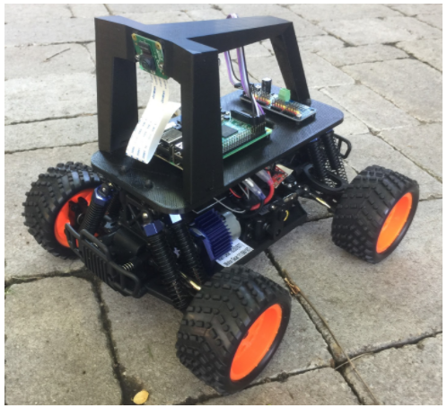
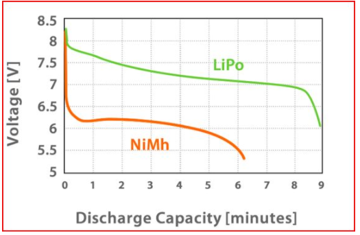
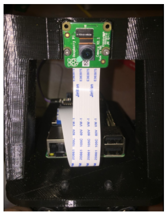
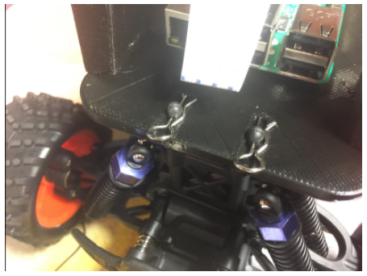
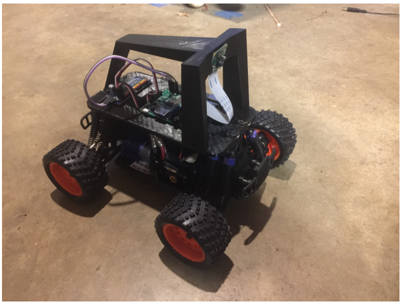

# Donkey V2 の作り方

&nbsp;

* [概要](build_hardware.md#overview)
* [必要となる部品](build_hardware.md#parts-needed)
* [ハードウェア:](build_hardware.md#hardware)
    * [Step1: 部品の#Dプリント](build_hardware.md#step-1-print-parts)
    * [Step 2: 部品のクリンナップ](build_hardware.md#step-2-clean-up-parts)
    * [Step 3: 天板およびロールケージの組み立て](build_hardware.md#step-3-assemble-top-plate-and-roll-cage)
    * [Step 4: Raspberry Pi へサーボシールド接続](build_hardware.md#step-4-connect-servo-shield-to-raspberry-pi)
    * [Step 5: 天板にRaspberry Pi を組み付け](build_hardware.md#step-5-attach-raspberry-pi-to-3d-printed-bottom-plate)
    * [Step 6: カメラの組み付け](build_hardware.md#step-6-attach-camera)
    * [Step 7: 残りの組み立て](build_hardware.md#step-7-put-it-all-together)
 * [ソフトウェア](install_software.md)

&nbsp;

## 概要

これらは、2017年発行の [雑誌「Make:」 ]((https://makezine.com/projects/build-autonomous-rc-car-raspberry-pi/)) に掲載された記事から更新された手順ガイド です。ソフトウェアインストール手順の最新バージョンは、ソフトウェアの説明のセクションで管理されています。あなたの車を組み立てた後は、必ずその指示に従ってください。

## 車両の選択
完全サポートされている車両として、「Exceed」ブランドで市販されている4つのシャーシがあります： 

*  Exceed Magnet [Blue](https://www.amazon.com/gp/product/9269803775/?tag=donkeycar-20), [Red](http://amzn.to/2EIC1CF)
*  Exceed Desert Monster [Blue](http://amzn.to/2HLXJmc),  [Red](http://amzn.to/2pnIitV)
*  Exceed Short Course Truck  [Blue](https://amzn.to/2KsYF1e),  [Red](https://amzn.to/2rdtQ8z)
*  Exceed Blaze [Hyper Blue](https://amzn.to/2rf4MgS), [Yellow](https://amzn.to/2jlf3EA)

これらの車は電気回路は同じですが、タイヤの取り付け方法などが異なります。これらのうち Desert Monster、Short Cource Truck、Blazeはさらにアダプタ(Donkey Storeから3-Dプリンタ用設計図データや出力品を購入可能)が必要であることに注意してください。上記の車種は、ほとんどがプラグアンドプレイであるため、標準の車両としています。いずれもトレーニングを容易にするブラシ付きモーターを備えており、粗い路面をうまく扱い、そして安価です。

[この動画](https://youtu.be/UucnCmCAGTI) では、いくつかの車種について概要や組み立て方法を紹介しています。

さらに、"Donkey Pro"の名前で3台の車がサポートされています。 これらは 1/10 スケールの車で、上記4台より大きく、少しだけ性能が良いですが、やや高価です。 HobbyKing Trooper（プロバージョンではない）は [ここ](https://hobbyking.com/en_us/turnigy-trooper-sct-4x4-1-10-brushless-short-course-truck-arr.html?___store=en_us) にあります。HobbyKing Mission-Dは [ここ](https://hobbyking.com/en_us/1-10-hobbykingr-mission-d-4wd-gtr-drift-car-arr.html) にあります。
Tamaya TT01やそのクローン車は世界中で見つけることができますが、通常はキットとして構築します。 他の2台の車はDonkey Carにする準備ができていますが、組み立てるのは難しいです。

ここには、さまざまなモデルを紹介している [ビデオ](https://youtu.be/K-REL9aqPE0) があります。 Donkey Proのモデルはまだよく記述していませんので、あらかじめ警告しておきます。

：詳細やその他の車種については、 [サポート対象車リンク](/supported_cars.md) を参照してください。

&nbsp;
## 独自車両の組み立て
RCについての経験をもち、Donkey が標準としてサポートしていない車両で製作したい場合は、もちろん自分で独自車両を組み立てることができます。その際に一助となるクイックリファレンスがあります。  [独自車両の組み立て](/roll_your_own.md) を参照のこと。

## 必要となる部品:

### Option 1: 公式Donkeyストアからの購入
2つの公式ストアが利用可能です：

米国にいる場合は、Donkey Store を使用できます。Donkey Store の目的は、Donkey Car を作るのをより簡単により安くすることです。Donkey Store は、Donkey Car の元々の創業者によって運営され、利益は Donkey Car の開発に資金を提供するために使用されます。また Donkey Store からの部品の設計は、大量にしか入手できないか、入手が困難だがより良い部品を使用するため、標準ビルドよりも若干アップデートされていることにも注意してください。Donkey Store のビルドは、他のすべてと同様にオープンソースです。

あなたがアジアにいるなら、香港の DIY Robocars コミュニティも [DIY Robocar Store](https://www.robocarstore.com/products/donkey-car-starter-kit) でキットを販売しています。彼らは長期的な Donkey のコミュニティメンバであり、収益を使ってこのプロジェクトの研究開発活動を支援しています。香港のストアはヨーロッパや米国にも販売することができますが、コストが高くなる可能性があることに注意してください。

> 上記の [DIY Robocar Store](https://www.robocarstore.com/products/donkey-car-starter-kit) にて購入する場合、PayPalで4万円弱かかります。PayPalアカウントにも対応していました。2～3営業日の配送オプションつけても受け取りまで約1週間かかり、日本国内の税関料は荷物受け取り時に1500円支払いました（支払いがあるため、宅配ボックスには入れてもらえません）。Raspberry Pi本体やSDカードまで含まれているので、入手後すぐに始めることが出来ます。ただし交換用のバッテリが必要な場合、国内で入手が困難です(ミニタミヤプラグの7.2VNiMHバッテリ)。到着までに、香港BFタイプメスー日本国内オスの変換プラグ、プラスティック用ボンド(ロールケージと天板はボンドのほうが楽)の準備を推奨します。なおキット購入の場合、DCDCコンバータで１つのバッテリから給電するため、以下の表にふくまれている microUSB ケーブル付き USB バッテリは不要です。なお、このドキュメントにはありませんが、SDカードに書き込めるPCとインターネット接続可能なWiFiルータが必要です。

| 部品の説明                                                                    | リンク                                                                                  | 参考価格 |
|-------------------------------------------------------------------------------------|---------------------------------------------------------------------------------------|------------------|
| Exceed Magnet, Desert Monster, Blaze, or Short Course Truck                                                                       | S上記リンク確認のこと                                     | ~米90ドル              |
| microUSBケーブルつきUSB バッテリ (2A 5V の出力) | [Anker 6700 mAh](http://amzn.to/2ptshm0)                                           | 米17ドル              |
| Raspberry Pi 3                                                                      | [amazon.com/gp/product/B01CD5VC92](https://www.amazon.com/gp/product/B01CD5VC92?tag=donkeycar-20)                                          | 米38ドル              |
| マイクロSD カード (どれでも動作可能、これは推奨品です)             | [amazon.com/gp/product/B01HU3Q6F2](https://www.amazon.com/gp/product/B01HU3Q6F2?tag=donkeycar-20)                                         | 米18.99ドル           |
| Donkey 3Dプリント済み部品キット                                                      | [Magnet用] ](https://squareup.com/store/donkeycar/item/magnet-partial-kit) または [Desert Monster, SCT, Blaze 用](https://squareup.com/store/donkeycar/item/desert-monster-short-course-truck-or-blaze-partial-kit)                                         | 米85ドル もしくは 米92ドル              |

### Option 2:ボトムアップビルド
自分で部品を購入したい、 Donkey をカスタマイズしたい、または米国以外に在住の場合は、ボトムアップビルドを選ぶことができます。

| 部品の説明                                                                    | リンク                                                                                  | 参考価格 |
|-------------------------------------------------------------------------------------|---------------------------------------------------------------------------------------|------------------|
| Magnet RCカー本体(もしくは代替品)                                                                        | [青](https://www.amazon.com/gp/product/9269803775/?tag=donkeycar-20), [赤](http://amzn.to/2EIC1CF)                                         | $92              |
| M2x6 ネジ (4個)                                                                     | [mcmaster.com/#91292a831/=177k4rp](https://www.mcmaster.com/#91292a831/=177k4rp)                                          | 米6.38ドル &ast;          |
| M2.5x12 ネジ (8個)                                                                  | [mcmaster.com/#91292a016/=177k574](https://www.mcmaster.com/#91292a016/=177k574)                                          | 米4.80ドル &ast;          |
| M2.5 ナット (8個)                                                                       | [mcmaster.com/#91828a113/=177k7ex](https://www.mcmaster.com/#91828a113/=177k7ex)                                          | 米5.64ドル &ast;          |
| M2.5 ワッシャ (8個)                                                                    | [mcmaster.com/#93475a196/=177k7x6](https://www.mcmaster.com/#93475a196/=177k7x6)                                          | 米1.58ドル &ast;          |
| microUSBケーブルつきUSB バッテリ (2A 5V の出力) | [Anker 6700 mAh](http://amzn.to/2ptshm0)                                           | 米17ドル              |
| Raspberry Pi 3                                                                      | [amazon.com/gp/product/B01CD5VC92](https://www.amazon.com/gp/product/B01CD5VC92?tag=donkeycar-20)                                          | 米38ドル              |
| マイクロSD カード(どれでも動作可能、これは推奨品です)             | [amazon.com/gp/product/B01HU3Q6F2](https://www.amazon.com/gp/product/B01HU3Q6F2?tag=donkeycar-20)                                         | 米18.99ドル           |
| ワイドアングル Raspberry Pi カメラ                                                      | [amazon.com/gp/product/B00N1YJKFS](https://www.amazon.com/gp/product/B00N1YJKFS?tag=donkeycar-20)                                         | 米25ドル              |
| メスーメス ジャンパ線                                                        | [amazon.com/gp/product/B010L30SE8](https://www.amazon.com/gp/product/B010L30SE8?tag=donkeycar-20)                                          | 米7ドル &ast;             |
| Servo ドライブ PCA 9685                                                               | [amazon.com/gp/product/B014KTSMLA](https://www.amazon.com/gp/product/B014KTSMLA?tag=donkeycar-20)                                          | 米12ドル &ast;&ast;           |
| 3D プリント済みロールケージおよび天板                                                 | 販売元: [Donkey Store](https://squareup.com/store/donkeycar) 3Dプリンタ入力用ファイル: [thingiverse.com/thing:2260575](http://www.thingiverse.com/thing:2260575) | 米45ドル                 |

&ast; これらの製品は、Donkey Car1台に必要な量よりもはるかに多い数量となっています。あなたが友人と数台構築する場合、車の総費用は米20ドルほど安くなります。

&ast;&ast; この製品は、出荷のために15～45日間待つ場合がありますが、Ali Expressであれば～2日で購入できます。（訳者注：日本国内は対象外）

&nbsp;

### オプションとなるアップグレード
* **LiPo バッテリおよびアクセサリ:** LiPoバッテリは、エネルギ密度が大幅に向上し、より良いドロップオフ曲線を示します。以下を参照してください（Traxxasの礼儀）。

> 香港のキットはNiMHバッテリが同梱されています。LoPoバッテリに変更可能ですが、ESC上のジャンパコネクタの設定を変更することを忘れないでください。

| 部品の説明                                      | リンク                                                              | 参考価格 |
|-------------------------------------------------------|-------------------------------------------------------------------|------------------|
| LiPo バッテリ                                          | [hobbyking.com/en_us/turnigy-1800mah-2s-20c-lipo-pack.html](https://hobbyking.com/en_us/turnigy-1800mah-2s-20c-lipo-pack.html) もしくは [amazon.com/gp/product/B0072AERBE/](https://www.amazon.com/gp/product/B0072AERBE/) | 米8.94ドル ~ 米17ドル           |
| Lipo 充電器 (上記バッテリを1時間でチャージ可能)  | [amazon.com/gp/product/B00XU4ZR06](https://www.amazon.com/gp/product/B00XU4ZR06?tag=donkeycar-20)                                               | 米13ドル              |
| Lipo バッテリケース (爆発時の被害を減らすため) | [amazon.com/gp/product/B00T01LLP8](https://www.amazon.com/gp/product/B00T01LLP8?tag=donkeycar-20)                                               | 米8ドル               |

&nbsp;

## ハードウェア
Donkey Car ストアから部品を購入した場合は、Step 3 に進んでください。
### Step 1: 部品の3Dプリント

3Dプリンタをお持ちでない場合は、 [Donkey Store](https://squareup.com/store/donkeycar), [Shapeways](https://www.shapeways.com/) または [3dHubs](https://www.3dhubs.com/) からパーツを注文できます。私は黒プラスティック(black PLA)、高さ2mm、サポートなし、でパーツをプリントしました。上部のロールバーは、上下逆さまに印刷されるように設計されています。あなたが "Magnet"車両を持っていない限り、アダプタをプリントする必要があることを忘れないでください。

> 日本国内でも3Dプリント代行する業者は存在します。DMM.makeでは上記リンクのファイルフォーマットそのものを送信して見積もりを取ることが出来ましたが、とても上記参考価格におさまる値段ではありませんでした。

私の場合は、0.3mmレイヤ高、0.5mmのノズルをサポートなしで、黒プラスティック(black PLA)でパーツをプリントしました。。上部のロールバーは、上下逆さまに印刷されるように設計されています。

&nbsp;
### Step 2: 部品のクリンナップ
3D プリント直後の部品のほとんどすべてがクリンナップをおこなう必要があります。穴をきれいにドリルしなおして、余分なプラスチックを掃除してください。

特に、下図に示すように、ロールバーの側面にあるスロットをきれいにしてください。 

&nbsp;
### Step 3: 天板へのロールケージ組み立て
Exceed ショートコーストラック、ブレイズまたはデザートモンスターの場合は [このビデオ](https://youtu.be/UucnCmCAGTI) を見てください。

ロールケージの側面にあるスロットにナットを差し込みます。これは特に簡単なことではありません。穴をもう一度きれいにし、小さなドライバを使ってネジを押し込んで、ロールケージの底にある穴に合わせます。

> 香港キット品の場合も、車体前方2箇所にこの作業が必要です。ただしこの作業は難易度が高く、香港のキットでは対応するナットが不足するため、手っ取り早くプラスチック用ボンドで固定する方法を勧めます。

ナットをスライドさせたら、底板を取り付けることができます。この作業は少し難しいかもしれません。小さなドライバを使ってナットを押して、スロット内で回転しないようにします。よいニュースがあります。この作業は決してもう一度行う必要はありません。

&nbsp;
### Step 4: Raspberry Piへサーボシールド接続
Raspberry Pi を底板に取り付けた後にこれを行うことができます。作業台に寝かせているときにパーツを見るのが簡単だと思います。以下のようにパーツをつなぎます。

参考までに、下記の Raspberry Pi ピンアウトが参考になります。3.3V、2つのI2Cピン（SDAとSCL）、グランド(GND:0Vのこと)に接続していることがわかります。

&nbsp;
### Step 5: Raspberry Pi を 3D プリント済み天板に組み付け  
始める前に、フラッシュ済みのSDカードを挿入し、電子機器のベンチをテストしておくとよいでしょう。それが完了したら、Raspberry Pi とサーボの取り付けは、ボードを通ってトッププレートのネジボスにネジを通すのと同じくらい簡単です。M2.5x12mmのネジは、ボード、プラスチックを通すのに最適な長さでなければならず、ワッシャのためのスペースがあります。ネジの「キャップ」部分が上を向くようにし、ナットを天板の下に置いてください。イーサネットポートとUSBポートは前方を向いている必要があります。これはSDカードへのアクセスを提供し、カメラリボンケーブルを適切に整列させるので重要です。

ケーブル帯またはベルクロを使用して、USBバッテリをプリントされた底板の下面に取り付けます。

&nbsp;
### Step 6: カメラの組み付け
Donkey シャーシには2つのバージョンがあり、新しいロールゲージにはネジがありません(キットには木ねじが2個用意されている)。古いロールゲージにはネジで組み付けます。このため、両方の手順について、それぞれ説明します。

**ねじが必要ではない設計**
新しいデザインはかなりシンプルです。ケーブルをスロットの先に滑らせてください。ただし、カメラのレンズを押さえずに、ボードを押さないように注意してください。

カメラを取り外す必要がある場合、レンズを押す誘惑の代わりにこれらの写真に示されているようにコネクタを押してください。
 

**ねじが必要な設計**

カメラを取り付けるのはちょっと難しいですが、M2ネジはプラスチックにねじ込むことができます。私は1.5mmのビット（インペリアルランドの1/16ビット）で穴を開けることをお勧めします。その後、カメラを設置する前にねじであらかじめ通しておいてください。2本のネジを入れるだけです。

>上側のネジ穴を使用すると、短くなることがあります。下の2つの穴にねじを入れます。

車を使用する前に、カメラのレンズからプラスチックフィルムを取りはずしてください。

カメラのケーブルを間違った向きに置くのは簡単ですので、これらの写真を見て、ケーブルが正しく取り付けられていることを確認してください。慣れていない場合は、チュートリアルが参考になるでしょう。

&nbsp;
### Step 7: のこりの組み立て
**Desert Monster Chassis を持っている場合、下の7Bセクションを参照してください**
最後の手順は簡単です。まずロールバー組み付け済みの天板を車に取り付けます。これは、車両に付属のピンを使います。

次に(ESCからのびているスロットルと、前輪サーボからのびているステアリングの)2組のサーボケーブルを天板の穴をとおします。スロットルケーブルはサーボコントローラのチャネル0に接続し、ステアリングはチャネル1に接続します。 

これでハードウェアが完成しました！ 

> 香港のキット品の場合、DCDCコンバータの組付けが終わっていません。まずDCDCコンバータを天板に組み付け、USBケーブルでRaspberry Piとmicro-Bコネクタへ接続します。Raspberry PiはUSB給電させるようになっています。次に同梱の二股ミニタミヤコネクタケーブルの黒赤むきだしのケーブル側をDCDCコンバータへ接続します。そしてESCとつながっている電源スイッチがOFFになっていることを確認し、ESCとこの二股ケーブルを接続します。同梱の充電器とBF変換コネクタで充電したバッテリを車体に組み付け、ピンで止めます。バッテリ側の電源を二股の元側とつなぐと、ESC側のスイッチがオフになっていてもRaspberry Piが起動してしまうので、実際に動かすまでこのコネクタは外しておきます。ジャンパ線側の接続は、｛Pi:PCA9685}=紫{3.3V:VCC},灰{GPIO2:SDA},白(黃){GPIO1:SCL},黒{GND:GND}でつなぎます。

### Step 7b: アダプタ部品の接続（Desert Monsterのみ）

Desert monster は、ボディを車に保持するための同じセットアップを持っていないため、2つのアダプタ部品が必要です。アダプタ部品を取り付けるには、まず、車両側シャーシから既存のアダプタ部品を取り外し、この写真に示されているのと同じネジで3Dプリント済みアダプタ部品をねじ込む必要があります。

この作業が終わったら Step 7に戻ります。

&nbsp;
## ソフトウェア
おめでとう！今すぐあなたの車を動かすためには、 [ソフトウェアについて説明しているセクション](install_software.md) を参照してください。

> 上記のいくつかのリンク元は、アフィリエイト広告プログラムであるAmazon Services LLC Associates Programに参加して、我々（訳者注：Donkey創設者たちのこと）がAmazon.comや提携サイトから手数料を得るよう組み込まれています。

