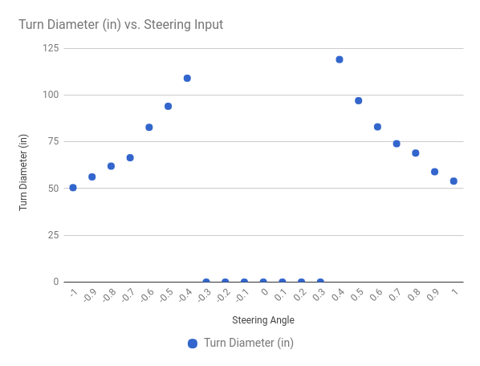

# あなたの車のキャリブレーション(調整)

あなたの車をキャリブレーション（調整）するポイントは、あなたの車が他の車と一緒に運転できるようにすることにあります。次の指示に従ってください。

## あなたの車の設定の調整方法

車の設定はすべて `config.py` スクリプトで行います。このファイルは、 `donkey createcar --path ~/mycar` コマンドを実行する際にテンプレートが作成されます。このファイルを編集して、あなたの車の動作を設定します。
   ```bash
   nano ~/mycar/config.py
   ```

私たちの目標は、これらの設定を編集して、他のすべてのキャリブレーションされたDonkey2のようにあなたの車が運転できるようにすることです。この方法で、各車の間でパイロットとデータセットを共有することができます。


> キャリブレーションを行うには、Raspberry Pi に ssh する必要があります。


## ステアリングのキャリブレーション

> 車が暴走状態となることを防ぐために、タイヤが地面から離れていることを確認してください。

1. あなたの車に電源を入れる(バッテリコネクタをつなぎ、ESCの電源スイッチをONにする)。
2. 車のサーボケーブルを見つけて、どのチャンネルがPCAボードに接続されているかを確認してください。1または0でなければなりません。
3. `donkey calibrate --channel <your_steering_channel>`　を実行してください。
4. `360` と入力して、車の車輪がわずかに動くのを見なければなりません。もし動かなければ `400` もしくは `300` と入力します。
5. 次に、車がすべて左へ曲がりそしてすべて右へ曲がるPWM設定を見つけるために開始時の値から `+/-10` した値を入力してください。これらの値を思い出してください。
6. これらの値を `config.py` スクリプト内の `STEERING_RIGHT_PWM`  および `STEERING_LEFT_PWM` に入力してください。


## スロットルのキャリブレーション


1. ESCからつながっているケーブルを見つけ、それがどのチャンネルをPCAボードに入れるのかを見てください。これがあなたのスロットルチャンネルです。
2. `donkey calibrate --channel <your_throttle_channel>` を実行してください。
3. PWM値の入力を求められたら `370` と入力します。
4. キャリブレーションされたことを示すESCビープ音が聞こえるはずです。
5. `400` と入力すると、車の車輪が前方に進むのが見えます。そうでない場合は、逆の可能性がありますので、代わりに `330` と入力してください。
6. 異なる値を試して合理的な最高速度を見つけこのPWM値を覚えるまで続けてください。

RCカーでの後進は、ESCが逆方向パルス、ゼロパルス、逆方向パルスを受信して​​後方に進む必要があるため、ややこしいです。リバース PWM 設定をキャリブレーションするには...

1. 上記と同じテクニックを使用して、PWM設定をゼロスロットルに設定します。
2. 逆の値を入力し、次にゼロスロットルの値を入力し、逆の値を再度入力します。
3. 逆の値の `+/-10` の値を入力して、妥当な逆速度を見つけます。逆 PWM 値を覚えておいてください。

`config.py` のスロットル操作部分を、キャリブレーション作業で得られたPWM値に変更します。
* `THROTTLE_FORWARD_PWM` = 全速前進時のPWM値
* `THROTTLE_STOPPED_PWM` = 停止時のPWM値
* `THROTTLE_REVERSE_PWM` = 全速後進時のPWM値


## キャリブレーションの微調整


これで、だいたいの調整が終わった車ができたので、実際に運転して、期待通りに走行することを確認します。車のキャリブレーションをさらに微調整する方法は次のとおりです。


1. Donkey Car上のRaspberry Piにて `python manage.py drive` を実行し運転開始状態にします。
2. ブラウザで `<Donkey CarのIPアドレス>:8887` を開きます。
3. 車の操舵がすべて正しい方向になるまで `j` キーを押します。
4. 車を前進させるために数回 `i` キーを押す。
5. ターンの直径をメジャーで測定し、スプレッドシートに記録します。
6. 反対の方向にも同様の測定を行います。
7. 車がどちらの方向に同じ操舵ができているかを確認します。


修正例
* 80％ターンと100％ターンで同じ直径になったら、そのターン方向のPWM設定を80％のPWM値に変更します。
* 片方向に偏りが生じている場合、偏っていない方向側のステアリングPWM値を変更します。


微調整後、ステアリングチャートは次のようになるはずです。


