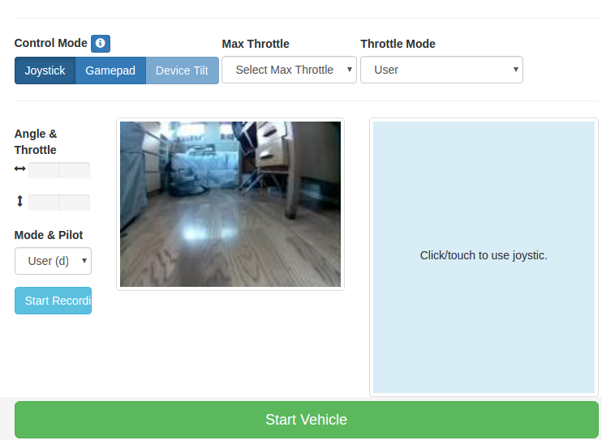

# 車の運転

Donkey Car のキャリブレーションが完了したら、運転をはじめましょう。

### 運転の開始

> *** 車体の下にものを置き、タイヤが設置していない状態にしてください。 ***
このStepを実行すると、車は動き出します。

---
# 通常の使い方
新しいセッションを開始します：

Windowsの場合:

* ホストPC上で Anaconda Prompt を新たに起動します。
* donkey Python セットアップを有効にします: ```activate donkey``` 
* 自動運転アプリを作成するディレクトリへ移動します: ```cd ~/mycar```
* 車載されているRaspberry Piを探します。


これはあなたのIPアドレスを表示し、あなたのパスワードのためのプロンプトを表示し、車のIPアドレスを検索します。

> 上記は、おそらく`donkey findcar`コマンドの説明だと推測しますが、現時点ではWindowsのAnaconda Prompt上では実行することは出来ません(上記のパスワードもsudoのためのもの)。

> もしIPアドレスが表示されなかった場合:
>
> 1. 別の方法でローカルネットワーク上のRaspberry Piを探してください。
> 2. モニタ/キーボードを接続してwifiネットワーク設定を確認してください。


ネットワーク上のRaspberry Piを発見したなら、SSH経由で接続します。

```
ssh pi@<Raspberry PiのIPアドレス>
```

デフォルトユーザ名は`pi`で、パスワードは `raspberry` です。もしプリビルドイメージ(キット同梱のSDカード)を使用しているのであれば、デフォルトのパスワードは `asdfasdf` です。


### 独自の自動運転アプリの作成
```
donkey createcar --template donkey2 --path ~/mycar
```

詳細は [こちら](/utility/donkey/#create-car) を参照のこと。

#### 運転の開始
アプリケーション用ディレクトリを開き、運転を開始します。
```
cd ~/mycar
python manage.py drive
```

このスクリプトは、車をコントロールするためのWebサーバを含んだ運転ループを開始します。次のURLを開くとブラウザから車を操作することができます： `<Donkey CarのIPアドレス>:8887`



## Web コントローラによる運転

携帯電話から開始ボタンを押すと、携帯電話本体の現在の傾き状態をゼロスロットル、正面ステアリングにセットします。携帯電話を前に倒すと前進し、横に倒すとその方向へステアリングを切ります。

### 機能
* Recording - Start Recording ボタンを押して、画像イメージ、アングル値、スロットル値の記録を開始します。
* Throttle mode - スロットルを一定に設定するオプション。レース時など、操縦はコントロールしますが、スロットルは操作しない場合に使用します。
* Pilot mode - パイロットが操舵 および/または スロットルをコントロールする場合に選択します。
* Max throttle - 最大スロットルを選択します。


### キーボード ショートカット
* `スペース` : 停車し、記録を終了
* `r` : 記録のオン・オフ
* `i` : 増速
* `k` : 減速
* `j` : 左回頭
* `l` : 右回頭

----

## 物理ジョイスティックによる運転

物理的なジョイスティックデバイスを使って車をコントロールすることができます。


### Setup Bluetooth の設定およびジョイスティックのペアリング
Check the [コントローラ章](/parts/controllers/#physical-joystick-controller) を確認して、Bluetooth接続設定について確認してください。

### 運転の開始
```
cd ~/mycar
python manage.py drive --js
```

常にジョイスティックを使うため、 `--js` を追加したくない場合、`config.py` を編集し、`USE_JOYSTICK_AS_DEFAULT` 値を `True` に変更してください。
```
nano config.py
```


### ジョイスティックの操作

* 左アナログスティック -  左右のステアリングを調整する
* 右アナログスティック - 前方に増速する
* 右アナログスティックを２度引くと逆進する

> User Mode の場合など、スロットルがゼロでない場合は常に運転データが記録されます。

* selectボタンでモード切り替え - User、Local Angle、Angle、Local(操作および前後進)
* △ボタン - 最大スロットルに増速
* ✕ボタン - 第第スロットルから減速
* ◯ボタン - 記録のオンオフ（デフォルトではオフ、スロットルがゼロでない場合デフォルトでは自動記録）
* 上ボタン - スロットル値を上げる（増速）
* 下ボタン -  スロットル値を下げる（減速）
* 左ボタン -  操舵角を左へ
* 右ボタン -  操舵角を右へ
* startボタン -  スロットル値固定オンオフ、最大スロットにセット（✕や△で変更）


### 手動運転の開始
```
cd ~/mycar
python manage.py drive --model <モデルファイルへのパス> --js
```

selectボタンを押して、User/Local Angle/Local Throttle & Angle の３つのモードを切り替えることが出来ます。
* User - 操舵、前後進をユーザがジョイスティックでコントロール
* Local Angle - 操舵のみAIコントロールし、スロットルはユーザが操作
* Local Throttle & Angle - 操舵、前後進をAIでコントロール

Local Angle モードでニューラルネットワークがステアリング操作を行っている場合、ユーザは必ずスロットル操作をしなくてはなりません。


