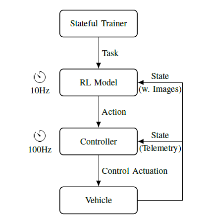
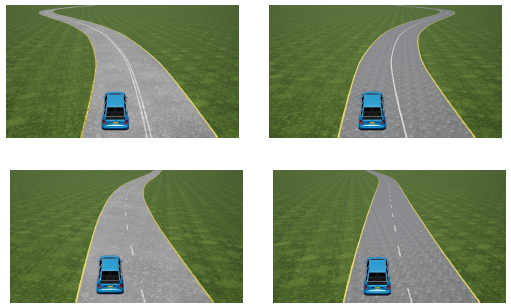
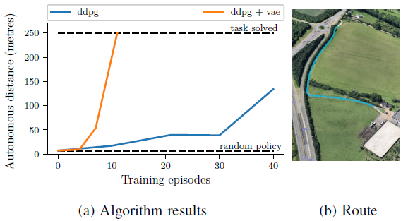

> 注意
> この文章は、論文 "[Learning to Drive in a Day](https://arxiv.org/abs/1807.00412)" を日本語に勝手に翻訳しました。
　
> Note.
> This was translated from "[Learning to Drive in a Day](https://arxiv.org/abs/1807.00412)" into Japanese.


# 1日で運転を学習する

- 著者

 - Alex Kendall, Jeffrey Hawke, David Janz, Przemyslaw Mazur, Daniele Reda, John-Mark Allen, Vinh-Dieu Lam, Alex Bewley, Amar Shah


### 概要

我々は最初に、自動運転に深層学習を適用したアプリケーションを示す。我々のモデルは、単一の単眼画像を入力として使用し、ランダムに初期化されたパラメータから、少数のトレーニングエピソードにより、車線のポリシーを学習することができる。我々は一般的かつ単純に得られる報酬として「安全運転者が運転することなく、車両が走行した距離」を提供する。 我々は、継続的なモデルフリーの深層強化学習アルゴリズムを使用して、すべての探索と最適化を車上で行った。 これは、定義された論理ルール、マッピング、そして運転者による直接管理からの依存から遠ざける自動運転のための新たな枠組みを示している。我々は広範な自動運転タスクへこのアプローチ適用挑戦や機会について議論する。

## 1. はじめに

自動運転は、移動や輸送を根本的に変革する可能性があり、研究コミュニティ、企業の両方から大きな関心を集めているトピックである。 概して、今日までのほとんどのアプローチは、注釈付き3D幾何学マップにおける運転行動を定義するフォーマルな論理に焦点を当てている。 これは、主にローカルシーンの理解を使用するのではなく、外部のマッピングインフラストラクチャに大きく依存するため、拡張が難しい場合がある。

自動運転を真のユビキタスな技術にするために、我々は地図や明示的なルールがないときにも(turn-by-turn ルートコマンドなど)包括的に直近の環境を把握し [1] 、～まるで人間のように～運転し誘導するロボットシステムを提唱する。最近の研究では、農村の田舎道では実現可能であり、粗い位置測定にGPSを使用して、LIDARを使って現在の状態を理解するデモが行われている [2]。

近年、強化学習 (RL) という、ある報酬関数を最大限にしようとしている環境で行動を選択することを、エージェントが学習するマルコフ決定問題 (MDP) [3] を解くことに重点を置く機械学習分野にて、囲碁 [4] やチェス [5] などのゲームにおける成果や、コンピュータゲームのようなシミュレートされた環境での大きな可能性 [6]、ロボットマニピュレータによる簡単なタスクの成果 [7] などで超人的成果を達成する能力を示しています。我々の主張は、強化学習の一般性は、自動運転に適用しても有用な枠組みになる、ということです。 最も重要なことは、学習された自動運転による動作を改善するための是正メカニズムを提供することである。

この目的のために、この論文では、MDPとして自律的な運転を行い、この問題のさまざまな要素をどのように設計して解決しやすくするかを説明し、一般的で拡張可能なままにして、標準的なRLアルゴリズム ）は、シミュレーション環境で簡単に自律的な運転を学び、実世界の車両で効率的かつ安全に運転するための学習を行うために必要なシステム設定について話し合い、数回にわたり実世界の自律走行車を運転する方法を学ぶ オンボード計算のみを使用した連続深い強化学習アルゴリズムです。

この目的のために、この論文では、

1. MDPとして自動運転を行い、この問題のさまざまな要素をどのように設計して解決しやすくするかを説明し、一般的で拡張可能なままにして、
2. シンプルな自律走行のシミュレーション環境における、標準的な強化学習アルゴリズム(深層決定論的ポリシー勾配 [8] )を示し、
3. 実際の乗り物で効率的かつ安全に運転するための学習を行うために必要なシステム設定を議論し、
4. 継続的な深層強化学習による現実の自律走行車の運転を学習する。その際 アルゴリズムであり、オンボード計算のみを使用する。


図1:自動運転のための深層強化学習アルゴリズムを設計する。 この図は、運転のためのポリシーと価値関数を学ぶために使用するアクタークリティックアルゴリズムを示している。エージェントは、セーフティドライバの介入前に移動距離の報酬を最大にする。自動運転が学習されていることを示す動画は、https://wayve.ai/blog/l2diad で参照可能である。

## 2. 関連する研究

深層強化学習が自律的な運転の実行可能なアプローチであることを示す最初の研究であると考えている。 我々は、模倣学習よりも拡張の可能性があることに動機づけられており、研究コミュニティは、自動運転を強化学習の観点からより密接に検討することを望む。 現在の文献の中で最も近い研究は、主に模倣学習またはマッピングに依存する古典的アプローチのいずれかに分類することができる。


### a. __Mapping アプローチ__ ：

早期の例 [9], [10] より、自動運転システムは、発達したセンサリングやコントロールアルゴリズム [11], [12], [13] を使うことで、複雑な環境でも安全に誘導するように設計されてきた。これらのシステムは、伝統的には、知覚、状態推定、マッピング、計画及びコントロールといった、独立して設計された多くのコンポーネントで構成されている [14] 。しかし、個々のコンポーネントを個別に指定し調整する必要があるため、複雑な相互依存関係により、より困難な運転シナリオへ拡張することは困難である。
このモジュラーアプローチのためのコンピュータビジョンコンポーネントには多大な努力が集中しています。意味論的セグメンテーション [1] といった知覚方法に対して、マップされた環境の範囲内での車両の操作 [16] を簡単にする [15] のようなローカライゼーションはロボットにシーンを解釈させることを可能にする。これらのモジュール化されたタスクは、[17] や [18] のベンチマークによってサポートされています。
これらのモジュラーマッピング手法は主に自動運転システムを開発する商業的努力の焦点である。しかし、これらはまだ解決されていない、非常に複雑なシステムエンジニアリングの課題を提示している。


### b. __模倣学習__ ：

いくつかの運転課題に対するより最近のアプローチには、専門家のデモンストレーションを観察することによって制御ポリシーを学習することを目的とする模擬学習 [19]、[20] がある。
このアプローチの重要な利点の1つは、エンド・ツー・エンドの深層学習を使用して、最終目標に関してモデルのすべてのパラメータを最適化し、各コンポーネントの調整作業を削減できることである。 しかし、模倣学習も規模を拡大することは困難である。 エージェントが遭遇する可能性のあるあらゆるシナリオを模倣するエキスパートのサンプル入手は不可能であり、（例えば、各レーンにおける運転など）実証されたポリシーを配置することは困難である。


### c. __強化学習__ ：

強化学習は、マルコフ決定問題 (MDPs) [21] を解くための幅広いアルゴリズムの分野である。MDPには次のようなものが含まれている：

* 状態集合 $S$
* 行動集合 $A$
* 遷移確率関数 $p: S \times A \to P(S)$ 、各ペア $(s, a) \in S \times A$ において遷移確率 $p(\cdot|s,a)$ は状態 $s$ から行動 $a$ により任意の状態に入る確率を表す。
* 報酬関数 $R(s_{t+1}, s_t, a_t)$ 、状態 $s_t$ から行動 $a_t$ を選択することにより状態 $s_{t+1}$ へうつる際の報酬 $R(S_{t+1} , s_t, a_t)$ をあらわす。
* 将来の報酬にどれくらい関心があるかを表す将来の割引率 $\gamma \in [0,1]$

MPDの解は、ポリシー $\pi: S \to A$ が、それぞれの $s_0 \in S$ において以下の式を最大化する：

```math
V_\pi(s_0) = \mathbb{E} ( \sum_{t=0}^{\infty} \gamma^t R(s_{t+1}, s_t, \pi(s_t))),  (1)
```

ここで、 $p(s_{t+1}|s_t, \pi(s_t))$ に従ってサンプリングされた状態 $s_{t+1}$ についての期待値が引き継がれる。

我々の設定では、上の公式の無限の代わりに有限の時間軸 $T$ を使用する。これは、状態の1つが終点(terminal)であることと等価である。すなわち、脱出することはできず、その状態の行動は報酬をゼロにする。

先の方程式を再帰的な形に再整理すると、2つのベルマン方程式の1つが得られる。

```math
V_\pi(s_0) = \mathbb{E} ( R(s_1, s_0, \pi(s_0)) + \gamma^V_{\pi}(s_1))   (2)
```

ここで、 $p(s_1|s_0, \pi(s_0))$ に従ってサンプリングされた $s_1$ のみ期待値が引き継がれる。参考として、ほかのベルマン方程式は：

```math
Q_{\pi}(s_0, a_0) = \mathbb{E} (R(s_1, s_0, a_0) + \gamma Q_{\pi}(s_1, \pi(s_1))),   (3)
```

ここで、 $Q_{\pi}(s_0, a_0)$ は行動 $a_0$を有する状態 $s_0$から開始し、その後のポリシー $\pi$に続く間に受け取られる予想累積割引報酬である。再度、$p(s_1, s_0, a_0)$ にしたがってサンプリングされた $s_1$ についての期待値が引き継がれる。

言い換えれば、強化学習アルゴリズムは、高い累積報酬を得るポリシー $\pi$ を学習することを目的とする。

これらは一般的には、モデルベースおよびモデルフリーの強化学習の2つのカテゴリに分割される。  前者の方法では、遷移関数と報酬関数の明示的なモデルを学習し、その推定された関数の下で累積的な報酬を最大化するポリシーを見つけるために使用される。 後者では、状態 $s$ において行動 $a$ をとる値 $Q(s, a)$ を直接推定し、各状態において最も高い推定値を有する行動を選択するポリシーに従う。

モデルフリー強化学習は非常に一般的です。 モデルベースのアルゴリズムは学習したモデルと同じくらい良いが、それを使って想像できるどんなタスクも（理論的に）学ぶことが可能である。 他方、モデルベースの方法は、モデルを持たない方法よりもデータ効率が良い傾向がある。 詳細は、[22] を参照のこと。

自動運転では、オフラインデータを用いたモデルベースの強化学習のダイナミクスモデルを学習するために深層学習が用いられている [23] 。 強化学習は、ビデオゲームの自律運転エージェントを学習するためにも使用されている。しかしながら、これは単に車線と車の角度のような、現実世界では利用できない地上の実際の報酬シグナルにアクセスすることは問題になり得る [8] 。

この論文に対する最も近い研究は、Riedmiller ほか、がある。[24] では、障害物のない環境でGPS軌道に追従するように車両を駆動する補強学習エージェントを訓練する。彼らは、GPSしきい値に基づくトラッキングエラーに基づく高密度の報酬関数を使用して車上での学習を実証している。我々はこの研究をさまざまな形で構築している；イメージベースの入力から、車線に沿って走るための疎な報酬関数による深層学習を使って運転を実証している。

## 3. システムアーキテクチャ

### A. __マルコフ決定プロセスとしての運転__

この論文の主な焦点は、MDPとしての運転のセットアップである。 我々の目標は自動運転であり、状態空間 $S$ 、行動空間 $A$ 、報酬関数 $R$ の正確な定義は自由に定義することが可能である。 遷移モデルは、状態と行動の表現が固定されると暗黙的に固定され、残っている自由度 - 遷移自体は、使用されるシミュレータ/車両のメカニズムによって決定される。

#### a. __状態空間__ ：

状態空間を定義する鍵は、各時間ステップでアルゴリズムが受け取る観測値Otの定義である。 LIDAR、IMU、GPSユニット、IR深度センサに限らず、運転アルゴリズムの高度な観測を提供するために多くのセンサが開発されている。高度なセンシング技術が無限に予算を消費する可能性がある。この論文では、簡単な運転タスクのために、単眼カメラ画像と、観測された車速およびステアリング角度を使用するだけで十分であることを示す。理論的には、状態 $s_t$ は、以前のすべての観測値のマルコフ表現とする。例えば、リカレントニューラルネットワークを使用して観測を再帰的に結合することにより、固定長の近似マルコフ状態を得ることができる。しかし、我々が考慮する作業のためには、観測そのものが状態の十分な近似として役立つ。

第2の考慮点は、画像そのものをどのように扱うかである。生画像は一連の畳み込みを介して強化学習アルゴリズムに直接供給される。 例えばVariational Autoencoder（VAE） [26] [27] を使用して、画像の小さな圧縮表現を使用することができる。4章ではこれらの2つのアプローチを用いた強化学習の性能を比較する。 我々の実験では、KL損失とL2再構成損失を用いて、5つの全くランダムな探索エピソードからオンラインでVAEを訓練する [27] 。

#### b. __行動空間__ ：

運転自体には、スロットル、ブレーキ、シグナルなどの自然な行動が考えられるが、強化学習アルゴリズムの出力はどのような領域にする必要があるだろうか？ スロットル自体は、[0、1]に等長な範囲で、オンまたはオフ、または連続的に離散的に記述することが可能である。 別の方法として、速度設定点の点でスロットルを再パラメータ化することであり、従来のコントローラによるスロットル出力を用いて設定点に一致させる試みである。 全体的に、単純なシミュレータ (4章A) の実験は、連続的な行動は、学習するのがいくらか難しいが、滑らかなコントローラを提供することを示した。我々は2次元の行動空間を使用した。操舵角は [-1, 1] の範囲とし、速度設定ポイントは km/h である。


#### c. __報酬関数__ ：

報酬関数の設計は教師あり学習に近づくことができる - 車線分類システムを想定した場合、車線中心からの予測距離を最小化するという観点から、車線追従を学習する報酬を設定することができる [8] 。このアプローチは規模が限定される。システムは、手作りの報酬の背後にある人間の直感と同じくらい良いことがあります。 私たちはこのアプローチを取っていません。 代わりに、報酬を前方速度と定義し、交通規則の違反時にエピソードを終了させる - したがって、所与の状態 $V(s_{t})$ の値は、違反の前に移動した平均距離に対応する。 英国では右折であるのに米国では左折といった、識別されうる問題は、エージェントがより困難な操作の回避を選択することができる。コマンド条件付き報酬は、将来の研究においてこういった問題を避けるために利用されるかもしれない。

### B. __強化学習アルゴリズム__

我々はシンプルで継続的な行動ドメインモデルフリーな強化学習アルゴリズムである、深層決定論的政策勾配(deep deterministic policy gradients: DDPG) [8]を選択した。3A章では、タスク特有の適応をもたない既存の強化学習アルゴリズムがMDPを解くことができることを示す。

2つの関数近似から構成されるDDPG: 評価 $Q: S \times A \to \mathbb{R}$ 、ここで次に示すベルマン方程式を満足するようにトレーニングされた、状態 $s$ におけるアクション $a$ を使用した場合の期待累積割引報酬の値 $Q(s, a)$ を推定する。

```math
Q(s_{t}, a_{t}) = \gamma_{t+1} + \gamma(1 - d_{t})Q(s_{t+1}, \pi(s_{t+1})),
```

アクター $\pi:S \to A$ によって与えられたポリシーの管理下において、Q最適ポリシー $\pi(s) = argmax_{a}Q(s, a)$ の推定を試みる；ここで $(s_{t}, a_{t}, r_{t+1}, d_{t+1}, s_{t+1})$ は、過去の経験のバッファから選択された報酬 $r_{t+1}$ と"完了(done)"フラグ $d_{t+1}$ を受け取り、それを用いて状態 $s_{t}$ から $s_{t+1}$ への遷移である経験タプルである。評価を最小化しようとするベルマン等式における誤差は、時間差( __TD__ )誤差と呼ばれる。アクター評価手法には多くの変形が存在する。[28]、[29] を参照のこと。

DDPGトレーニングはオンラインで行われる。現実の車両で使うためのバッファを設定するインフラストラクチャ（欠落/不完全なエピソードやいつでも停止可能であることを要求する）のほかに、再生バッファから最も有益なサンプルを選択することによって補強学習を高速化することができる。我々は、優先順位をつけた経験リプレイ [30] と呼ばれる一般的に確立された方法を用いて行った：評価によって作られた __TD__ 誤差に比例する確率で経験タプルをサンプリングする。このサンプリングに使用される重みは、各最適化ステップで最小のオーバーヘッドで更新される。すべてのサンプルが少なくとも1回は見えるように、新しいサンプルには無限の重みが与えられる。

DDPGはオフポリシー学習アルゴリズムである。つまり、トレーニング中に実行される行動は、アクターによる学習最適ポリシーとは異なるポリシーから来ている。これは、最適なポリシーによって見られる狭い分布の外で多様な状態 - 行動データを得るために起こり、したがって頑健性を高めている。 我々は、継続的な強化学習の方法の中でこれを達成するための標準的な方法を使用している。我々の探査ポリシーは、Ornstein-Uhlenbeckプロセスノイズ [31] を最適なポリシーに追加することによって形成される。したがって、各ステップで、次の式によって与えられる最適な動作ノイズ $x_{t}$ を追加する：


```math
x_{t+1} = x_{t} + \theta(\mu - x_{t}) + \omega \epsilon_{t},   (4)
```

ここで $\theta$ 、$\mu$ 、$\sigma$ はハイパーパラメータであり、 ${\epsilon_t}_t$ は標準分布 $N(0, 1)$ からサンプリングされる i.i.d ランダム変数である。これらのパラメータは、ノイズユーティリティと安全ドライバの快適性との間に直接トレードオフがあるため、慎重に調整する必要がある。より低い分散を伴う強い反復騒音は、予測がより容易であり、より高い分散騒音は、より良好な状態 - 行動空間のカバレッジを提供する。

```
1: 無限ループ開始
2:     タスクを要求
3:     環境のリセットのための待機
4:     トレーニングの場合
5:         ノイズ入ポリシーでエピソードを実行
6:         探査時間が終わった場合
7:             モデルの最適化
8:
9:     テストの場合
10:        最適化されたポリシーでエピソードを実行
11:    undo の場合
12:        直前のトレーニング/テストタスクに戻す
13:    done の場合
14:        終了する
15:
16: 無限ループ終わり
```

(a) 実車訓練のためのタスクベースワークフロー



(b) ポリシー実行アーキテクチャ、モデルのトレーニングまたはテスト中にエピソードを実行するために使用される

図2 安全運転者のフィードバックからアルゴリズムを効率的に訓練するためのワークフローとアーキテクチャの概要

### C. __タスクベーストレーニングアーキテクチャ__


現実の世界環境で走っているフルサイズのロボット車両に強化学習アルゴリズムを配置するには、ドライバーの介入とトレーニングに影響を与える外部変数の両方を考慮に入れて、共通のトレーニング手順を調整する必要がある。

安全運転者が異なるタスクを制御している 図2a に概略を示した単純な状態マシンとして、アルゴリズムのアーキテクチャを構成します。 トレーニング、テスト、取り消し、完了の4つのタスクを定義します。 これらのタスクの定義は、システムをインタラクティブかつステートフルにすることを可能にし、先験的な固定スケジュールではなく、エピソードのオンデマンド実行を優先する。

図2aにてアウトラインを示した単純なステートマシンとしてアルゴリズムのアーキテクチャを構成した。アーキテクチャの中では安全運転者が異なるタスクを制御している。アーキテクチャ内では、トレーニング、テスト、undo、doneの4つのタスクを定義している。これらのタスクの定義は、対話型およびステートフル型の両方をシステムに許可し、先験的な固定スケジュールではなく、エピソードのオンデマンド実行を優先している。


トレーニングおよびテストのタスクは、現在のポリシーを実行して自動運転モードで車両と対話することを可能にする。2つのタスク間の違いは、テストタスクが直接モデル出力の行動を実行するのに対し、トレーニングタスク内ではノイズが加えられたモデル出力でモデルが最適化される点にある。初期のエピソードでは、状態空間の探索に有利なように最適化をスキップする。テスト報酬が増えなくなるまで実験を続行する。

各エピソードは、システムが自動化が失われたことを検出する（すなわち、運転者が介入する）まで実行される。現実世界の環境では、シミュレーション内のエージェントや制約のある環境とは異なり、システムをエピソード間で自動的にリセットすることはできない。我々は、人間の運転手に車両を有効な始動状態にリセットすることを要求する。エピソードの終了時に、安全運転者がこのリセットを実行する間、モデルは最適化され、エピソード間の時間を最小限に抑える。

undo（取り消し）およびdone（終了）タスクは、アーキテクチャの主な違いを示している。正しく運転されない以外の様々な有効な理由でエピソードを終了することがある。これらのエピソードは、トレーニング目的の場合は考慮することができない。undoタスクはこのような理由から導入された。我々は、そのエピソードを元に戻すことができ、そのエピソードを実行する前の状態に復元することを可能としている。 我々の実験の一般的な例として、道路を使用している場合に他の運転者に遭遇することである。doneタスクでは、任意の時点で正常に終了することができ、手順はインタラクティブで一定数のエピソードでは実行されないので便利である。

## 4. 実験


ショーケースに使用される主なタスクは、車線追従による自動運転である。これは、[8] で扱ったのと同じ作業だが、実際の車両でもシミュレーションでも、車線の位置を知らなくても画像入力から行うことができる。それは運転のタスクコアであり、精神的なALVINN [19] の礎石だった。最初に4A章のシミュレーションでこのタスクを実行し、次にこれらの結果と適切なハイパーパラメータの知識を使用して、4B章にて実際の車両の解を実証する。

シミュレーションと現実世界の実験の両方で、小さな畳み込みニューラルネットワークを使用する。我々のモデルは、3×3のカーネル、2と16の特徴次元のストライド、アクターと評価のモデルとの間で共有される4つの畳み込み層を有している。次に、エンコードされた状態を平坦化し、ベクトルをアクターのスカラー状態に連結し、さらに振る舞いネットワークの行動を連結します。両方のネットワークでは、出力に回帰する前に、フィーチャサイズ8の完全連結レイヤを1つ適用する。VAE実験では、エンコーダと同じサイズのデコーダが使用され、ストライド畳み込みを転置畳み込みに置き換え、フィーチャをアップサンプリングする。図1を参照のこと。

### A. __シミュレーション__

画像入力に続くレーンのコンテキストで補強学習アルゴリズムをテストするために、Unreal Engine 4を使用して3D運転シミュレータを開発した。これは国道の生成モデルを含み、様々な気象条件と道路テクスチャをサポートする（図3のゲームスクリーンショットを参照のこと）。





図3. シミュレータにより連続するレーンの各エピソードごとにランダムに生成された異なる道路環境のサンプル。我々は手続き型を使って、各エピソードごとにランダムに道路のテクスチャ、車線標示、道路トポロジを変更する。正面向きのドライバービュー画像を入力としてトレーニングする。


シミュレータは、学習率、各トレーニングエピソードに続く勾配ステップの数および正しい終了手順を含む強化強化学習パラメータを調整するために不可欠であることが判明した。DDCGは適切な強化学習アルゴリズムであることを確認した。3A章の環境設定で説明したように、シミュレータで与えられた報酬は、車線を出る前に移動した距離に対応し、新しいエピソードで車を車線中央にリセットした。

我々は、10回のトレーニングエピソードの中で生の画像からシミュレーションに従うことを確実に学ぶことができることを確かめた。さらに、（Variational Autoencoderによって提供される）圧縮状態表現を使用することにほとんど利点がないことが判明した。実際の実験に使用する次のハイパーパラメータが最も効果的であることが判明した：future discount factor が0.9、ノイズ半減期が250、ノイズパラメータ $\theta$ が0.6、 $\sigma$ が0.4、エピソード間の最適化ステップが250件、バッチサイズが64、そして勾配クリッピングが0.005。


### B. __実世界での運転__

現実世界の運転実験は、シミュレーションのなかで多くの方法をもちい模倣している。 しかし、実世界でこの実験を実行することは、はるかに困難である。 多くの環境要因を制御することはできず、リアルタイムの安全制御システムを実装する必要がある。これらの実験では、実際の道路の250mセクションを使用する。車は、トレーニングのエピソードを開始するために道路の始点からはじめる。車が車線を逸脱して回復不可能な位置に入ると、安全運転者は車両を自ら制御して終了する。 その後、車は車線の中央に戻って次のエピソードを開始する。シミュレーションで効果的であることが判明したものと同じハイパーパラメータを使用し、ノイズモデルを調整して、車両自体のダイナミクス下でのシミュレーションと同様の挙動を与える。





図1で示した様に、2台の電気自動車である改造されたRenault Twizy車両を使用して実験を行っている。車両重量は500kg、最高速度は80km/h、単一バッテリ充電では100km走行可能である。車の前部にある屋根の中央に取り付けられた単眼の前方向きのビデオカメラを使用した。また、ブレーキとステアリングを作動させるために改造された電気モータを使用し、スロットル位置を電子的にエミュレートして車輪へのトルクを調整した。すべての計算は、単一のNVIDIA Drive PX2コンピュータを使用してオンボードで行われた。車両のドライブバイワイヤ自動化は、車両コントロール（ブレーキ、スロットル、またはステアリング）、自動運転モードの切り替え、または非常停止のいずれかを使用して、セーフティドライバが介入すると自動的に解除される。エピソードは、スピードが10km/hを超えるか、または自動運転が切断されたときに終了し、安全運転者が介入したことを示す。安全運転者は、車を道路の中心に戻し、次のエピソードを続行する。

これらの実験の結果を表1に示す。ここで重要な発見は、補強学習がいくつかの試行でこの問題を解決できるということである。バッチサイズが64の250個の最適化ステップを使用すると、約25秒かかった。次のエピソードを開始するために車を車の中心に向けて操縦すると、実験は非常に効率的であった。視覚的な複雑さがシミュレーションよりもはるかに難しい現実の世界では、ポリシーと共にオンラインで訓練されたVariational Autoencoderによって圧縮された状態表現が提供され、アルゴリズムの信頼性が大幅に向上した。 我々の手法を実際には重要なポリシーを必要としないことを確認するために、我々の手法をゼロポリシー（一定速度でまっすぐ運転する）と無作為探査ノイズとで比較した [^*] 。

[^*]: ステートフルな強化学習トレーニングアーキテクチャ（3C章）を使用して250mの長さの私設道路運転を学習している車両のトレーニングプロセスのビデオは https://wayve.ai/blog/l2diad で参照可能である。


|モデル|トレーニング<br>エピソード数|トレーニング<br>距離|トレーニング<br>時間|テスト<br>m/離脱|テスト<br>離脱回数|
|:---------------------|-----------:|------:|------:|-----:|-------:|
|ランダムポリシー      |      -     |   -   |   -   |  7.35|      34|
|ゼロポリシー          |      -     |   -   |   -   | 22.7 |      11|
|Pixelsから深層強化学習|          35| 298.8m|   37秒|143.2 |       1|
|VAEから深層強化学習   |          11| 195.5m|   15秒|   -  |       0|

表1. 250mの長さの道路での自動運転で深層強化学習を実施。その際のモデルごとの最高のパフォーマンス結果をレポート。ベースラインRLエージェントが最初から車線追従を学習させることは可能であったが、VAEバリアントははるかに効率的で、わずか11回のトレーニングエピソードの後にルートを成功裡に運転できるように学習させた。

## 5. 考察

この研究では、フルサイズの自動運転車両に深層強化学習を最初に適用した。この実験では30分以下のトレーニングで車線追従を習うことができ、すべてがオンボードのコンピュータで実行されている。

ハイパーパラメータを調整するために、我々は強化学習アルゴリズムを試すことのできるシンプルなシミュレートされた運転環境を構築し、DDPGを標準アルゴリズムとして使用して交通違反の前に距離を最大化した。検出されたパラメータは現実世界にも転用することができた。我々は私道上で実際の車両を運転するポリシーを急速にトレーニングした。 特筆すべきは、報酬には環境の詳細情報や地図は必要としなかったことである。より多くのデータ、車両、およびより大きなモデルでは、このフレームワークは、より複雑な運転タスクに拡大するのに十分一般的である。

実行可能ではあるが、このアプローチでは、強化学習学習の進歩の転換と、自動運転を拡大するための先導的アプローチになるためのコア強化学習アルゴリズムの研究が必要となる。我々は、今後必要となる研究についての我々の考えを考察することで結論とする。

本研究では、安全運転者の介入なしに移動距離を最大化するようエージェントに頼む一般的な報酬関数を提示する。 この報酬関数は一般的ですが、多くの制限が存在する。この報酬関数、所与のナビゲーション目標上のコンディショニングを考慮しない。 さらに、この報酬関数は信じられないほどまばら(スパース)である。 エージェントが改善するにつれて、介入が大幅に少なくなり、トレーニングシグナルが弱くなる。 スーパーヒューマンドライビングエージェントを学ぶためのより効果的な報酬関数を設計するためには、さらなる研究が必要となる可能性が高い。これには、多くの安全性 [32] と倫理的問題 [33] を慎重に考慮する必要がある。

ここでの結果が示唆する開発の第2の領域は、より良い状態表現である。我々の実験では、単純なVariational Autoencoderは、実際の車両を運転する状況でDDPGのパフォーマンスを大幅に向上させることが示されている。セマンティックセグメンテーション、奥行き、エゴモーション、ピクセルフローなどの分野での既存の研究では、運転シーンで重要なことを先んじて優れたものとしている [34] [1] [35]。この研究は、モデルのないモデルとモデルベースの両方の実際のタスクに対する強化学習アプローチと統合する必要がある。

しかし、教師なし状態符号化だけでは不十分である可能性が高い。少ないサンプル数でポリシーを簡単に学習できるように状態を圧縮するためには、状態のどの要素（画像観察）が重要であるかの情報が必要となる。この情報は報酬と端末(terminal)のシグナルから得られるべきである。報酬と端末情報はさまざまな方法でエンコーディングに組み込むことは可能だが常に困難である。特定のタイムステップで得られた報酬は、過去に多くのタイムステップを経た観察と関連している可能性がある。したがって、このアプリケーションに使用される良好なモデルには、時間的要素が含まれている。

実際の自動運転への強化学習の適用のためにデータの可用性を大幅に向上させることができる2つの領域は、準監督学習 [35] とドメイン移行 [36] である。運転データのほんの一部には報酬と端末が付いているが、取得にはコストがかかるため、画像埋め込みやモデルの他の側面には、毎日の車両のダッシュカメラから取り込まれたデータを活用することが可能である。これらは、イメージ自動エンコーダの事前トレーニングに使用することができる。モデルベースの強化学習システムの文脈では、これらは状態遷移関数を近似するためにも使用できるが、準監督学習の進歩によって報酬/端末ラベルデータなしでこのデータを利用できるようになる。一方、ドメイン転送によって、実際の車に直接転送できるポリシーを訓練するために、これらのデータを使用することができると十分に確信したシミュレーションを作成することが可能である。

ここで使用されているアルゴリズムは、意図的に一般的な標準的アプローチであり、強化学習が運転に適用される可能性を実証するために選択されている。自然勾配の使用を含む、より広い文献でそれに対する多くの改良が開発されている [37] 。他の研究では、一般的にRNN [38]、[39] を使用して、観測のより良い状態への変換を検討し、 [40] のように多段階計画を実行する方法を検討している。これらが優れたパフォーマンスを提供することは疑いのないことである。

モデルベースの強化の新しい進歩は、物理的システムの状態を直接観察する際に、モデルの優れた性能を示す [22] などの作業を伴う、自動運転研究の代替となるエキサイティングな手段を提供する。これは、画像ベースのドメインに大きな利点をもたらす。代わりのモデルベースのアプローチには、エピソードをシミュレートし、想像力で学習することを学ぶ [41] というものがあります。

この論文では、自動運転に補強学習の研究を適用し、おそらく模倣学習や制御理論などの他の機械学習技術の要素と組み合わせて、より多くの研究を促すことを願っている。ここでの方法は、半時間で簡単な運転課題を解決した。

一日で何ができるのでしょうか？

### 参考文献

[1]: V. Badrinarayanan, A. Kendall, and R. Cipolla, “Segnet: A deep convolutional encoder-decoder architecture for scene segmentation,”IEEE Transactions on Pattern Analysis and Machine Intelligence, 2017.
[2]: T. Ort, L. Paull, and D. Rus, “Autonomous vehicle navigation in rural environments without detailed prior maps,” in International Conference on Robotics and Automation (ICRA), 2018.
[3]: R. S. Sutton and A. G. Barto, Reinforcement Learning: An Introduction. MIT Press, 1998.
[4]: D. Silver, A. Huang, C. J. Maddison, A. Guez, L. Sifre, G. van den Driessche, J. Schrittwieser, I. Antonoglou, V. Panneershelvam, M. Lanctot, S. Dieleman, D. Grewe, J. Nham, N. Kalchbrenner, I. Sutskever, T. P. Lillicrap, M. Leach, K. Kavukcuoglu, T. Graepel, and D. Hassabis, “Mastering the game of go with deep neural networks and tree search,” Nature, vol. 529, no. 7587, pp. 484–489, 2016.
[5]: D. Silver, T. Hubert, J. Schrittwieser, I. Antonoglou, M. Lai, A. Guez, M. Lanctot, L. Sifre, D. Kumaran, T. Graepel, T. P. Lillicrap, K. Simonyan, and D. Hassabis, “Mastering chess and shogi by selfplay with a general reinforcement learning algorithm,” CoRR, vol. abs/1712.01815, 2017.
[6]: V. Mnih, K. Kavukcuoglu, D. Silver, A. A. Rusu, J. Veness, M. G. Bellemare, A. Graves, M. Riedmiller, A. K. Fidjeland, G. Ostrovski, et al., “Human-level control through deep reinforcement learning,” Nature, vol. 518, no. 7540, p. 529, 2015.
[7]: S. Gu, E. Holly, T. Lillicrap, and S. Levine, “Deep reinforcement learning for robotic manipulation with asynchronous off-policy updates,” in Robotics and Automation (ICRA), 2017 IEEE International Conference on. IEEE, 2017, pp. 3389–3396.
[8]: T. P. Lillicrap, J. J. Hunt, A. Pritzel, N. Heess, T. Erez, Y. Tassa, D. Silver, and D. Wierstra, “Continuous control with deep reinforcement learning,” in International Conference on Learning Representations (ICLR), 2016.
[9]: T. Kanade, C. Thorpe, and W. Whittaker, “Autonomous land vehicle project at cmu,” in Proceedings of the 1986 ACM fourteenth annual conference on Computer science. ACM, 1986, pp. 71–80.
[10]: R. S. Wallace, A. Stentz, C. E. Thorpe, H. P. Moravec, W. Whittaker, and T. Kanade, “First results in robot road-following.” in IJCAI. Citeseer, 1985, pp. 1089–1095.
[11]: M. Montemerlo, J. Becker, S. Bhat, H. Dahlkamp, D. Dolgov, S. Ettinger, D. Haehnel, T. Hilden, G. Hoffmann, B. Huhnke, et al., “Junior: The stanford entry in the urban challenge,” Journal of field Robotics, vol. 25, no. 9, pp. 569–597, 2008.
[12]: J. Levinson, J. Askeland, J. Becker, J. Dolson, D. Held, S. Kammel, J. Z. Kolter, D. Langer, O. Pink, V. Pratt, et al., “Towards fully autonomous driving: Systems and algorithms,” in Intelligent Vehicles Symposium (IV), 2011 IEEE. IEEE, 2011, pp. 163–168.
[13]: U. Franke, D. Gavrila, S. Gorzig, F. Lindner, F. Puetzold, and C. Wohler, “Autonomous driving goes downtown,” IEEE Intelligent Systems and Their Applications, vol. 13, no. 6, pp. 40–48, 1998.
[14]: S. Thrun, W. Burgard, and D. Fox, Probabilistic robotics. MIT press, 2005.
[15]: C. Linegar, W. Churchill, and P. Newman, “Made to measure: Bespoke landmarks for 24-hour, all-weather localisation with a camera,” in Proceedings of the IEEE International Conference on Robotics and Automation (ICRA), Stockholm, Sweden, May 2016.
[16]: U. Muller, J. Ben, E. Cosatto, B. Flepp, and Y. L. Cun, “Offroad obstacle avoidance through end-to-end learning,” in Advances in neural information processing systems, 2006, pp. 739–746.
[17]: A. Geiger, P. Lenz, and R. Urtasun, “Are we ready for autonomous driving? the kitti vision benchmark suite,” in Proceedings of the IEEE Conference on Computer Vision and Pattern Recognition (CVPR), 2012.
[18]: W. Maddern, G. Pascoe, C. Linegar, and P. Newman, “1 year, 1000 km: The oxford robotcar dataset,” The International Journal of Robotics Research, vol. 36, no. 1, pp. 3–15, 2017.
[19]: D. A. Pomerleau, “Alvinn: An autonomous land vehicle in a neural network,” in Advances in neural information processing systems, 1989, pp. 305–313.
[20]: M. Bojarski, D. Del Testa, D. Dworakowski, B. Firner, B. Flepp, P. Goyal, L. D. Jackel, M. Monfort, U. Muller, J. Zhang, et al., “End to end learning for self-driving cars,” arXiv preprint arXiv:1604.07316, 2016.
[21]: R. S. Sutton, A. G. Barto, et al., Reinforcement learning: An introduction. MIT press, 1998.
[22]: M. Deisenroth and C. E. Rasmussen, “Pilco: A model-based and data-efficient approach to policy search,” in Proceedings of the 28th International Conference on machine learning (ICML), 2011, pp. 465–472.
[23]: G. Williams, N. Wagener, B. Goldfain, P. Drews, J. M. Rehg, B. Boots, and E. A. Theodorou, “Information theoretic mpc for model-based reinforcement learning,” in Robotics and Automation (ICRA), 2017 IEEE International Conference on. IEEE, 2017, pp. 1714–1721.
[24]: M. Riedmiller, M. Montemerlo, and H. Dahlkamp, “Learning to drive a real car in 20 minutes,” in Frontiers in the Convergence of Bioscience and Information Technologies, 2007. FBIT 2007. IEEE, 2007, pp. 645–650.
[25]: Y. LeCun, B. Boser, J. S. Denker, D. Henderson, R. E. Howard, W. Hubbard, and L. D. Jackel, “Backpropagation applied to handwritten zip code recognition,” Neural computation, vol. 1, no. 4, pp. 541–551, 1989.
[26]: D. P. Kingma and M. Welling, “Auto-encoding variational bayes,” in The International Conference on Learning Representations (ICLR), 2014.
[27]: D. J. Rezende, S. Mohamed, and D. Wierstra, “Stochastic backpropagation and approximate inference in deep generative models,” in Proceedings of the 31st International Conference on machine learning (ICML), 2014.
[28]: R. S. Sutton, D. A. McAllester, S. P. Singh, and Y. Mansour, “Policy gradient methods for reinforcement learning with function approximation,” in Advances in neural information processing systems, 2000, pp. 1057–1063.
[29]: V. Mnih, A. P. Badia, M. Mirza, A. Graves, T. P. Lillicrap, T. Harley, D. Silver, and K. Kavukcuoglu, “Asynchronous methods for deep reinforcement learning,” in International Conference on Learning Representations (ICLR), 2016.
[30]: T. Schaul, J. Quan, I. Antonoglou, and D. Silver, “Prioritized experience replay,” in International Conference on Learning Representations (ICLR), 2015.
[31]: G. E. Uhlenbeck and L. S. Ornstein, “On the theory of the brownian motion,” Phys. Rev., vol. 36, pp. 823–841, Sep 1930.
[32]: D. Amodei, C. Olah, J. Steinhardt, P. Christiano, J. Schulman, and D. Man´e, “Concrete problems in ai safety,” arXiv preprint arXiv:1606.06565, 2016.
[33]: J. J. Thomson, “The trolley problem,” The Yale Law Journal, vol. 94, no. 6, pp. 1395–1415, 1985.
[34]: A. Kendall, Y. Gal, and R. Cipolla, “Multi-task learning using uncertainty to weigh losses for scene geometry and semantics,” in Proceedings of the IEEE Conference on Computer Vision and Pattern Recognition (CVPR), 2018.
[35]: T. Zhou, M. Brown, N. Snavely, and D. G. Lowe, “Unsupervised learning of depth and ego-motion from video,” in Proceedings of the IEEE Conference on Computer Vision and Pattern Recognition (CVPR), 2017.
[36]: K. Bousmalis, N. Silberman, D. Dohan, D. Erhan, and D. Krishnan, “Unsupervised pixel-level domain adaptation with generative adversarial networks,” in The IEEE Conference on Computer Vision and Pattern Recognition (CVPR), 2017.
[37]: J. Schulman, S. Levine, P. Abbeel, M. Jordan, and P. Moritz, “Trust region policy optimization,” in International Conference on Machine Learning, 2015, pp. 1889–1897.
[38]: M. Hausknecht and P. Stone, “Deep recurrent q-learning for partially observable mdps,” CoRR, abs/1507.06527, 2015.
[39]: M. Igl, L. Zintgraf, T. A. Le, F. Wood, and S. Whiteson, “Deep variational reinforcement learning for pomdps,” in Proceedings of the 28th International Conference on machine learning (ICML), 2018.
[40]: G. Farquhar, T. Rockt¨aschel, M. Igl, and S. Whiteson, “Treeqn and atreec: Differentiable tree planning for deep reinforcement learning,” in International Conference on Learning Representations (ICLR), 2018.
[41]: D. Ha and J. Schmidhuber, “World models,” CoRR, vol. abs/1803.10122, 2018
