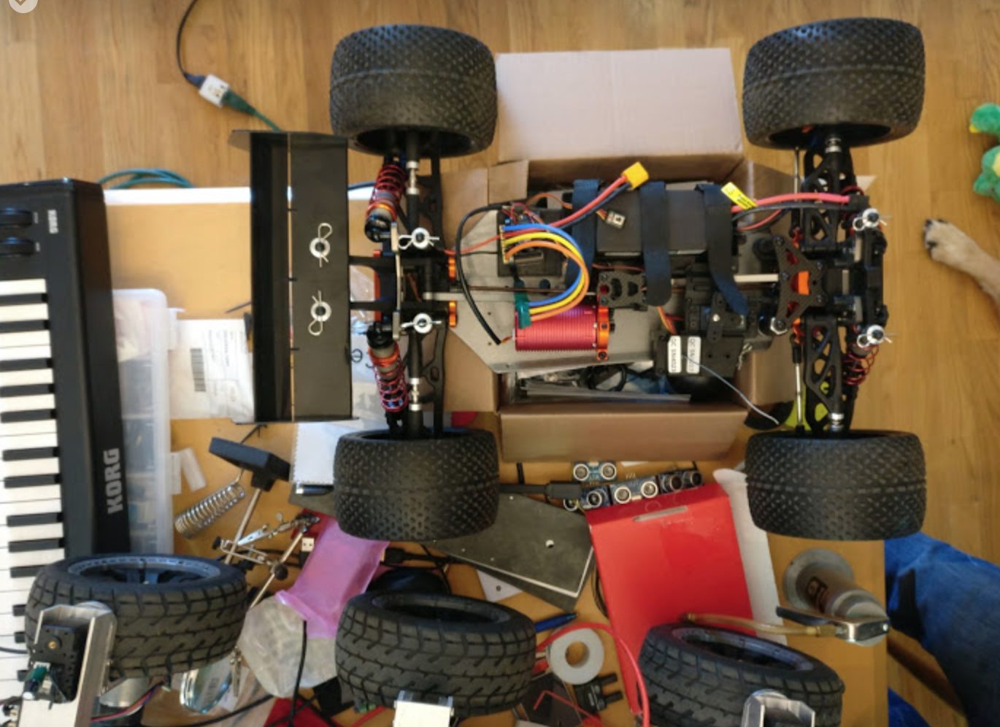

# 独自車両の開発

## The Quick and Dirty

* あなたの車はRaspberry Piから制御するのが簡単である必要があります。
* あなたの車はあまりにも重く危険なので（そして高価なので）、とても大きくする必要はありません。
* あなたの車は、最小限の量の装備を搭載する必要があるため、小さすぎる必要もありません。
* あなたの車は、それが意味を成すように、モデルがパワーとコントロールの最小性能基準を満たす必要があります。

これは、次のような意味です:

* あなたの車には、標準のRC 3ピン制御信号（RC PWMスタイル）を取るモータ（ESC）用のスピードコントローラが必要です。
* あなたの車には標準の RC 3 ピン制御信号（RC PWMスタイル）を取るステアリングサーボが必要です。
* あなたの車には、ESCとステアリング・サーボのそれぞれに標準100ミル（2.54 mm）のピン・ヘッダが入っているラジオ・レシーバーが必要です。
* DIYRobocars レースでレースをしたい場合、あなたの車は1/18スケール（最小）と1/8スケール（最大）の間にある必要があります。
* あなたの車は、ブラシ付きモータまたは感知されたブラシレスモータを使用する必要があります。センサレスブラシレスモータは、低速では粗すぎます。ブラシレスモータを搭載した車を購入する場合は、常にセンサレスブラシレスモータであり、ESCとともに交換する必要があります。

おそらく他のオプションも可能です（このドキュメントの最後を参照してください）。

多くの(Donkey Carのベースになるような)車両のメーカは、一般的に安価であるため、 "統合された" RC趣味の車を探すことになります。しかし、これらが安価である理由は、エレクトロニクスとメカニックスの多くの部分を単一のパッケージに統合することで実現している場合があります。これは、Raspberry Piで車を制御するために適切な信号をフックさせることができないことを意味します。また実際に、期待された信号は統合された車の中に全く存在しない場合があるかもしれません。

統合されたRXとESCの例を示します。これらは避けるべきです。 

電源レールと制御信号の違い、マイクロ秒の持続時間、ボルト、アンペア、ワット、時間、オーム、および他の測定単位の関係など、エレクトロニクスに関するいくつかのことを知る必要があります。

## サーボ仕様

RCに搭載されているサーボは、自動車のステアリングホイールを制御するために使用されます。サーボは、典型的には、電源ワイヤ（車によって異なる）に約4.8Vから6Vの入力があり、信号線にPWM制御信号が入力されることを想定しています。典型的には、3本のワイヤは、黒色 - 赤 - 白、または茶 - 赤 - 黄色であり、暗線（黒/茶色）がグランド(0V)、中心線（赤色）が電力(V)であり、光線（白/黄色）は制御です。

制御信号は1秒間に60回のパルスが送信されるRC形式のPWMで、このパルスの幅はサーボが左右にどのように回転するかを制御します。このパルスが1500マイクロ秒であるとき、サーボは中心に置かれます。パルスが1000マイクロ秒であれば、サーボは左（または右）に旋回し、パルスが2000マイクロ秒であるとき、サーボは他の方向に旋回します。これは、モータのデューティ・サイクルやLEDの輝度を制御するのに使用するのと同じ種類のPWMではありません。

サーボの電源は、通常、BEC（バッテリエリミネータ回路）が内蔵されたモータESCから供給されます。

## ESC 仕様

ESCの役割は、RC PWM制御信号（1000〜2000マイクロ秒間のパルス）を入力し、それを使用してモータへの電力を制御し、モータが順方向または逆方向に異なる電力量で回転するようにすることです。繰り返しますが、1500マイクロ秒は一般的には「中心」を意味しており、モータにおける「死点」を意味しています。

バッテリは一般的に、単純な制御信号よりも太い配線を使用してESCにまっすぐ接続します。これは、モータが制御より多くの電流を消費するためです。その後、ESCは同じ厚さの電源配線でモータに接続します。標準のDonkeyモータとESCのピーク電流はおそらく約12Aです。強力なブラシレスモータを搭載した1/8スケールのRCカーは、200Aまでピークを引き出すことができます！

さらに、ESCは、通常、ステアリングサーボを制御するのに必要な電力を出力する線形またはスイッチング電圧コンバータを含んでいます。これは典型的に4.8Vから6Vの範囲のどこかにあります。ESCに内蔵されているほとんどのBECは、約1A以上の電流を供給しないため、ステアリング・サーボとRaspberry Piの両方にBECから電力を供給することは通常不可能です。

## 受信機 仕様

「レシーバが必要」と表示されている「キットカー」を購入した場合、レシーバを購入する必要はありません。Raspberry PiとPCA9685ボードは受信機の役目を果たし、制御信号を車に出力します。ステアリング・サーボ、モータ、ESCが付属しているが、ラジオ機能のない「キットカー」を購入することは、実際にあなたが作る車が正しい信号を発することを確認する素晴らしい方法です。適切なPWM信号用に設計できるでしょう。

車にレシーバが付いている場合は、ステアリング・サーボとESC制御のために、3ピン・ヘッダが隣り合っていることを確認してください。一部のレシーバには追加のチャネル用の3ピンヘッダが追加されている場合があります。空の場合や、ホーン、ライトなどのファンシーアタッチメントを制御する場合があります。

トレーニングデータを収集するときにRCラジオを使用して車を運転する Donkey Car に修正が加えられました。これは、あなたが PlayStation のコントローラや携帯電話で普通に得るよりも、車のコントロールを良くします。ただし、PCA9685ボードを外付けマイクロコントローラで置き換え、donkey ソフトウェアを変更して使用する必要があります。

最後に、一部のレシーバは、PWM制御信号に加えて、制御信号を含むシリアルデータパケットを出力することができるものもあります。そのようなレシーバの一例として、PWM信号用に6つの出力チャネルを持つFS-i6Bがあります。FS-i6Bは、115,200 bpsでシリアルデータとして10チャネルのデータを出力することができます。これは、外付けマイクロコントローラが読み取ります。おそらくRaspberry Piに対して変更（Piブートローダの再構成と、donkeyソフトウェアへのカスタム変更)が必要です。

## バッテリ

標準Donkey Carには、NiMH（ニッケルメタルハイドライド）バッテリが付属しています。これは、バッテリを充電する前に少し時間（5-10分）をかければ、モータを動かすのに十分な状態になります。この電池の仕様は6セル、1100mAhです。NiHMバッテリの電圧範囲は0.9V〜1.35Vで、公称電圧は1.2Vであるため、5.4V〜8.1Vの範囲の電圧が期待できます。

NiHM電池は、重量と体積あたりに中程度の容量のエネルギを持っています。これをリチウムポリマバッテリ（LiPo）にアップグレードすることで、Magnet カーの走行時間やパフォーマンスを向上させることができます。通常リチウムバッテリは、1セルあたり3.2V〜4.2Vなので、2セルバッテリ（2S）では 6.4V〜8.4Vの範囲の電圧がラベル表示されます。リチウムポリマ電池は、一般により長い電流容量（バッテリは、走行中に1点で供給できる）とエネルギ貯蔵（バッテリが完全に充電された時のバッテリ使用回数）を有しています。

バッテリの充電量（動作時間）は、アンペア時またはミリアンペア時で測定されますが、バッテリ使用時の電流量は単純にアンペアで測定されます。しかし、混乱してしまいそうですが、アンペアはしばしば1時間で割ったエネルギー量の倍数で再計算されます。この比率はしばしば「C」と呼ばれます。したがって、10C 2000mAh 定格のLiPoは、運転中に20アンペアの電流を供給することができます。5C 1100mAh 定格のNiHMは、運転中に5.5アンペアの電流を供給することができます。一般的に電池は非常に短い時間だけC 定格以上のパワーを供給しますが、内部抵抗が発熱したり、通常の動作に頼ることができないように蓄積したりします。

カスタムカーの場合、車のESCとモータに必要な電圧に注意し、電圧に合ったバッテリを取得してください。 小型のRCカーには手頃な価格でNiMHが、電源としては2S LiPoが付属します。 大型RC車は、3S（11.1V）または4S（14.8V）または6S（22.2V）のリチウム電池を使用するため、一致するESCとモータの組み合わせが必要です。

最後に、バッテリに合った充電器を用意してください。LiPoバッテリをお使いの場合は、バッテリに合ったバランスの良いプラグを使用して、良好なリチウムバッテリ充電器を入手してください。リチウム電池をセルあたり3.2V以下で放電しないでください。あなたはそれが死んで実行させると、それは再び正常な電圧に充電されることを望んでいません、そうしようとすると非常にバッテリを過熱し、火のそばで発火する可能性があります！その模様はテスラの燃焼YouTube動画で確認できます。 $10 を節約するためにリチウム電池を再充電して、家を傷つけてしまったという動画です。（LiPo再充電には）それだけの価値はありません。代わりに、バッテリをバッテリ残量コネクタに差し込み、バッテリが放電してしまったときにビープ音が鳴り、バッテリの再充電を知らせる、バッテリアラームを入手してください。

## 物理的制約

トイカーで自動運転を実現するためにバッテリや電子機器を追加すると、自動車が最初に設計されたものより多くの負担がかかります。1/8スケールの大型車の場合、これはあまり問題にならないかもしれません。1/18スケール以下の小型車の場合、重さと重量が重くなるとステアリング出力にうまく反応しないため、自己駆動モデルでは車を制御できなくなる可能性があります。

標準のMagnetではない車を使用する場合は、少なくとも、すべてのハードウェアを安全に取り付ける方法を考える必要があります。積載するだけで、実際に配線や車輪を回転させることができないことが予想されます。良い取り付けポイントを見つけて、あなたが持っている車で測定し、あなた自身の「ベースプレート」を作ることが必要になるでしょう。このベースプレートは、3Dプリント、レーザー切断、CNCフライス加工、または薄い合板に穴をあけるだけでも構いませんが、シャーシにフィットすることが重要ですので、無理やり突っ込んだり、不用意にかどを削ったりしないでください。

Doug LaRue氏は、Thingiverseに [コンフィギュレータ](https://www.thingiverse.com/thing:2781404) を組み込んで、カスタムの3Dプリントを簡単に作成できるようにしました。

## その他オプション

そうです、あなたは1/5スケールのNitro Dragsterから自走車を作ることもできるのです。さまざまな場合についての解決策をもっと学び、すべての必要なインテグレーションを自分で把握するだけなのです。Nitro 車の制御信号は同じなので、難しくないかもしれません。しかし、Donkey レーシングミートアップに使用されている屋内競技場では、燃費の良い車は使用できません。

そうです、あなたはダイレクトPWM制御のLM298 Hブリッジを使用して、2つの車輪を「タンクステア（tank steer）」するための安価な2輪シャーシから自走車も作ることができます。しかし、右のステアリングコントロールを出力するには、donkeyソフトウェアを適合させる必要があります。また、HブリッジをRaspberry Piに接続する方法を理解する必要があります。PCA9685ボードから出力されるPWM信号は、モータ制御ではなく、RC制御です。また、最も手頃な価格の2輪駆動のロボットシャーシは、実際には強度が十分ではなく、機械的にも十分に安定しておらず、Donkeyカー候補者には不向きです。

