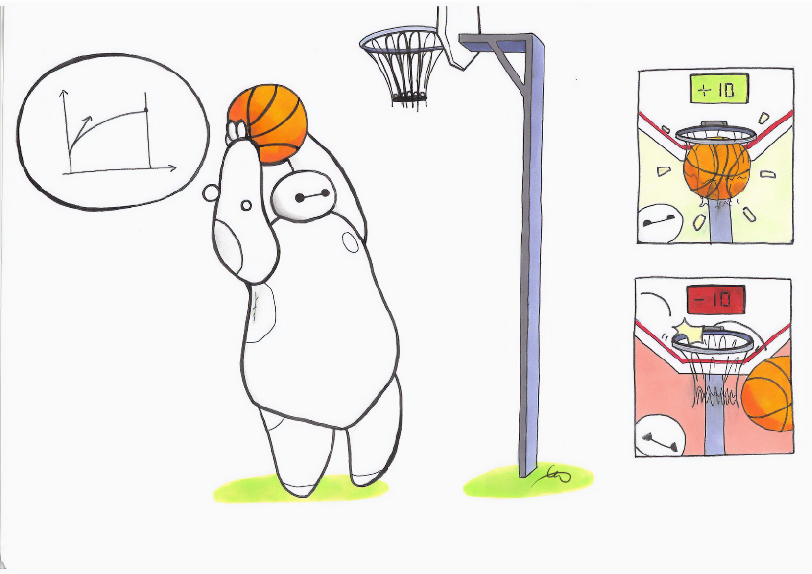
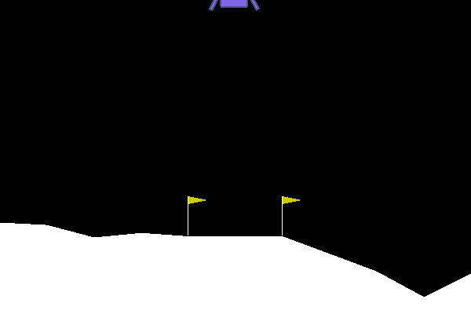
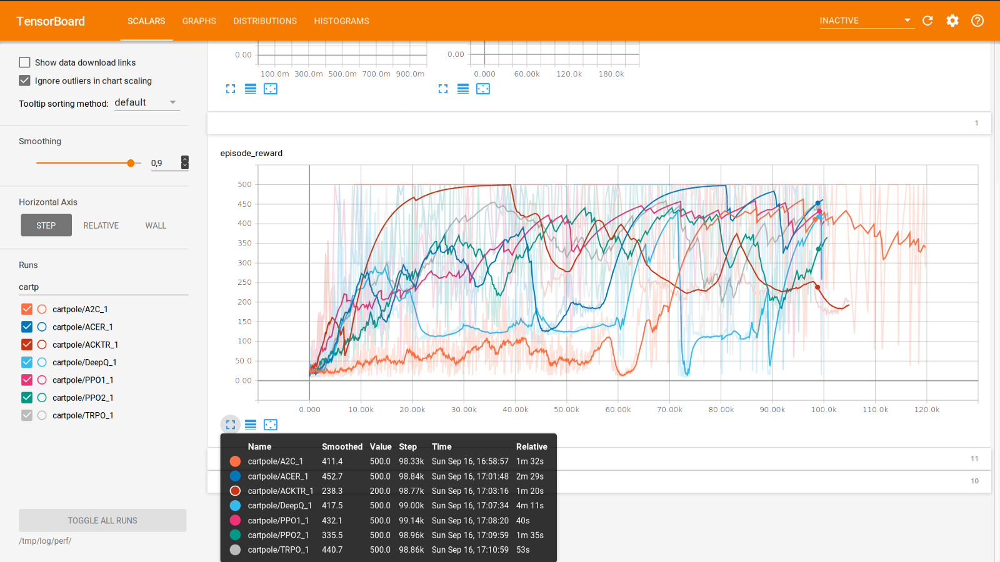
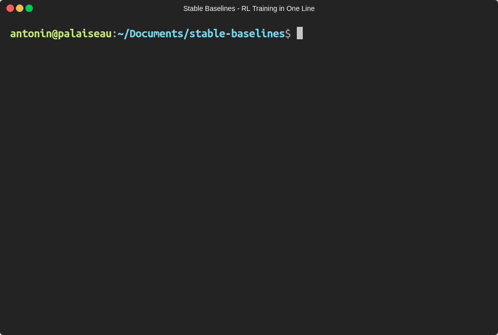

# Stable Baselines:OpenAI base lineのフォーク - より簡単に強化学習を行うために
## 統一された構造（scikit-learnのようなインターフェイス）とドキュメンテーションによる単一のコードスタイル





数週間の苦労を経て、OpenAI Baselinesに基づいた共通インタフェースによる強化学習（RL）アルゴリズムの実装セット Stable Baselines のリリースをようやく発表するはこびとなりました。私たちは、設計に当たり使いやすさと一貫性に焦点を当てました。この記事では、フォークのベースとなったパッケージや、さまざまな例（基本的な使い方、セーブ/ロードエージェント、簡単なマルチプロセッシング、Atariゲームのトレーニングなど）を紹介します。


**更新** : オンラインに [ドキュメント](http://stable-baselines.readthedocs.io/) を公開しました。また、Tensorboardのサポートが追加されました。

* [GitHub hill-a/stable-baselines](https://github.com/hill-a/stable-baselines)


TL;DR:
安定したベースラインでは、PPOエージェントのトレーニングは次のように簡単に記述できます。

```python
# from https://github.com/hill-a/stable-baselines
import gym

from stable_baselines.common.policies import MlpPolicy
from stable_baselines.common.vec_env import DummyVecEnv
from stable_baselines import PPO2

env = gym.make('CartPole-v1')
# Vectorized environments allow to easily multiprocess training
# we demonstrate its usefulness in the next examples
env = DummyVecEnv([lambda: env])  # The algorithms require a vectorized environment to run

model = PPO2(MlpPolicy, env, verbose=1)
# エージェントのトレーニング
model.learn(total_timesteps=10000)

# トレーニング済みエージェントでエンジョイ
obs = env.reset()
for i in range(1000):
    action, _states = model.predict(obs)
    obs, rewards, dones, info = env.step(action)
    env.render()
```

基本的な使い方：stable baselinesを使ったエージェントのトレーニング


もっとシンプルにすることはできますか？もちろんできますよ！stable baselines を使用すると、1行のコードで強化学習エージェントを定義してトレーニングすることができます。

```python

from stable_baselines import PPO2

# モデルの定義とトレーニングを１行で記述！
trained_model = PPO2('MlpPolicy', 'CartPole-v1').learn(total_timesteps=10000)
# 次の行から trained_model.get_env() を使ってgym env へアクセスすることができます
```

Google Colabでも試すことができます。

## フォークの歴史

私たちの研究で OpenAI Baselines を使い始めたころ、上手く機能する強化学習アルゴリズムを見つけることができ、うれしかったです [^1] 。しかし、画像の代わりに学習済みの機能を使おうとして、ちょっと微調整しようとした瞬間から、それは地獄になりました。コメントのないコードを修正しなければならなかったからです。

私たちが経験した困難の中には、コメントの欠如、有意義な変数名と一貫性（共通のコードスタイルなし）、多数の重複コード [^2] がありました。


GithubリポジトリのIssueでいうと、[＃285](https://github.com/openai/baselines/issues/285)、[＃400](https://github.com/openai/baselines/issues/400)、[＃413](https://github.com/openai/baselines/issues/413) 、[＃445](https://github.com/openai/baselines/issues/445) 、[Reddit](https://www.reddit.com/r/MachineLearning/comments/7l23y8/d_is_it_me_or_can_openai_baselines_be_difficult/)だけではありませんでした。

このため、Baselinesリポジトリのmasterブランチに関する新しいコミットがコードを破った後、2つのアイデアを念頭にフォークを作成することにしました。

* コメント付きコードとシングルコード
* すべてのアルゴリズムの共通インタフェース

[^1]: わたしたちの実験では、Baselinesコードベースのものは、他のコードベースと比較して（パフォーマンスの面で）最良の結果を与えるものでした。また、[ __Deep reinforcement learning that matters__ ](https://arxiv.org/abs/1709.06560) においてBaselines DDPG 実装は他のコードベースのものよりも優れていることを示すことができました。最近では、Dota 2をプレイしているOpenAI 5はPPOをデフォルトのコアとして使用しています。

[^2]: 執筆時点で、OpenAIはbaselinesの改善に努力しているようですが、それでもなお欠けているものが少なくありません。

### どんなアルゴリズムが含まれていますか？

OpenAI Baselines（およびフォークされた Stable Baselines）には、A2C、PPO、TRPO、DQN、ACKTR、ACERおよびDDPGが含まれています。[README](https://github.com/hill-a/stable-baselines)には、サポートされているもの（アクション・スペース、マルチプロセッシング）に関する概要が表形式で参照可能です。

Baselines には、事前処理やマルチプロセッシングなどの便利なラッパも付属しています。これらはサンプルコードで有用性を示しています。

## 新着情報?

### ユニファイドインターフェイス


すべてのアルゴリズムは同じ構造でデザインされています。私たちは、ちょうどscikitのようなインターフェースで実現したいと思っていました。サンプルコードでもわかるように、それは非常にシンプルなのです！

私たちは、すべてのアルゴリズムに対して _train_ ( _fit_ とおなじ）、_save_、_load_、および_predict_（_sk-learn_と同じ）のような一般的なメソッドを提供します。

### ロード、セーブ、ムーブのサポート

すべてのアルゴリズムのセーブ・ロード機能、コールバック（ライブプロット用）、完全な Tensorboard サポート、および行動確率の出力メソッドを追加しました。

### あらゆる種類のフィーチャのトレーニング

私たちは、任意のフィーチャに対するRLトレーニングのサポートを追加しました。つまり、RLアルゴリズムはピクセル以外のものでトレーニング可能です（現在のOpenAI Baselinesは、イメージを入力として使用しない場合、連続的行動のみをサポートします）。

実際には、**[状態表現学習](https://arxiv.org/abs/1802.04181)と、方策学習からの特徴抽出を分離すること**は、我々の研究の主題であり、最近の研究（例えば、[World Models](https://worldmodels.github.io/) と[Curiosity-Driven Learning：好奇心に基づく学習](https://pathak22.github.io/large-scale-curiosity/) ）の焦点にもなっています。したがって、私たちはこれをフォークの重要なフィーチャと考えました。


### より多くのテストとカバレッジ

OpenAIベースラインのリファクタリングを開始したとき、コードカバレッジはわずか16％でした。すなわち、すべてのコードステートメントの16％しかテストされまていませんでした。リファクタリング中にテストを追加し、65％のカバレッジを達成しました！（コードの大部分はMujoco関連の機能に由来し、Mujocoは商用の物理エンジンであるため、継続的インテグレーションが難しい）。

### バグ修正

私たちは [いくつかの問題を修正](https://github.com/hill-a/stable-baselines/releases) 時にコメントを利用しました。たとえば、フレームスタッキング用のラッパは、グレイスケール画像でのみ動作していました（ [OpenAIの以前のバグフィックス](https://github.com/openai/baselines/commit/4993286230ac92ead39a66005b7042b56b8598b0) は、[新しいコミットの 1つ](https://github.com/openai/baselines/commit/9fa8e1baf1d1f975b87b369a8082122eac812eb1) によって消去されていました ...）。

## サンプル：「話はもういいから、コードで教えて」

次のセクションでは、Stable Baselines の使用方法に関するさまざまなサンプルを取り上げます。[基本的な使い方](https://colab.research.google.com/drive/1_1H5bjWKYBVKbbs-Kj83dsfuZieDNcFU) 、セーブ/ロード、マルチプロセッシング、プロット、Atariゲームのトレーニングなどをカバーします。

### Google Colab notebookリスト

* [入門](https://colab.research.google.com/drive/1_1H5bjWKYBVKbbs-Kj83dsfuZieDNcFU)
* [トレーニング、セーブ、ロード](https://colab.research.google.com/drive/1KoAQ1C_BNtGV3sVvZCnNZaER9rstmy0s)
* [マルチプロセッシング](https://colab.research.google.com/drive/1ZzNFMUUi923foaVsYb4YjPy4mjKtnOxb)
* [モニタートレーニングとプロット](https://colab.research.google.com/drive/1L_IMo6v0a0ALK8nefZm6PqPSy0vZIWBT)
* [アタリゲームズ](https://colab.research.google.com/drive/1iYK11yDzOOqnrXi1Sfjm1iekZr4cxLaN)

### 基本的な使い方：トレーニング、セーブ、ロード

以下のサンプルでは、Lunar Lander環境でA2Cモデルをトレーニングし、セーブして、ロードします。

関連するColabノートブック： [オンラインで試してみてください！](https://colab.research.google.com/drive/1KoAQ1C_BNtGV3sVvZCnNZaER9rstmy0s)




```python
import gym

from stable_baselines import A2C
from stable_baselines.common.policies import MlpPolicy
from stable_baselines.common.vec_env import DummyVecEnv

# 環境の生成及びラップ
env = gym.make('LunarLander-v2')
env = DummyVecEnv([lambda: env])

model = A2C(MlpPolicy, env, ent_coef=0.1, verbose=1)
# エージェントのトレーニング
model.learn(total_timesteps=100000)
# エージェントのセーブ
model.save("a2c_lunar")
del model  # ロードデモのために一旦トレーニング済みエージェントを削除

# レーニング済みエージェントのロード
model = A2C.load("a2c_lunar")

# トレーニング済みエージェントでエンジョイ
obs = env.reset()
for i in range(1000):
    action, _states = model.predict(obs)
    obs, rewards, dones, info = env.step(action)
    env.render()
```

### マルチプロセッシング：ベクトル化された環境のパワーを解き放つ

関連するColabノートブック： [オンラインで試してみてください  ！](https://colab.research.google.com/drive/1ZzNFMUUi923foaVsYb4YjPy4mjKtnOxb)


```python
import gym
import numpy as np

from stable_baselines.common.policies import MlpPolicy
from stable_baselines.common.vec_env import SubprocVecEnv
from stable_baselines.common import set_global_seeds
from stable_baselines import ACKTR

def make_env(env_id, rank, seed=0):
    """
   マルチプロセッサ環境のためのユーティリティ関数
    
    :param env_id: (str) 環境ID
    :param num_env: (int) サブプロセスで使用したい環境数
    :param seed: (int) RNGへの初期シード
    :param rank: (int) サブプロセスのインデックス
    """
    def _init():
        env = gym.make(env_id)
        env.seed(seed + rank)
        return env
    set_global_seeds(seed)
    return _init

env_id = "CartPole-v1"
num_cpu = 4  # 使用するプロセス数
# ベクトル化された環境の構築
env = SubprocVecEnv([make_env(env_id, i) for i in range(num_cpu)])

model = ACKTR(MlpPolicy, env, verbose=1)
model.learn(total_timesteps=25000)

obs = env.reset()
for _ in range(1000):
    action, _states = model.predict(obs)
    obs, rewards, dones, info = env.step(action)
    env.render()
```

### Tensorboard によるトレーニングの監視
_v2.0.0の新機能_

OpenAIはTensorboardのサポートを提供しました（ドキュメンテーションの [レガシーインテグレーション](https://stable-baselines.readthedocs.io/en/master/guide/tensorboard.html) を参照）。完全なTensorboardインテグレーション（グラフの可視化、学習曲線など）を追加しました。

Tensorboard へのロギングを有効にするには、`tensorboard_log` 引数に有効なパスを指定する必要があります。

```python
from stable_baselines import A2C

model = A2C('MlpPolicy', 'CartPole-v1', verbose=1, tensorboard_log="/tmp/a2c_cartpole_tensorboard/")
model.learn(total_timesteps=50000)
```



この実験を再現するためのコード：https : //gist.github.com/araffin/ee9daee110af3b837b0e3a46a6bb403b

### コールバックの使用：トレーニングの監視

エージェント内で呼び出されるカスタムコールバック関数を定義することができます。これは、Tensorboard（またはVisdom）のライブラーニングカーブを表示したり、ベストエージェントを保存するなど、トレーニングを監視する場合に役立ちます。

関連ノートブック（プロットを含む）： [オンラインで試してみてください！](https://colab.research.google.com/drive/1L_IMo6v0a0ALK8nefZm6PqPSy0vZIWBT)

```python
import os

import gym
import numpy as np
import matplotlib.pyplot as plt

from stable_baselines.common.vec_env.dummy_vec_env import DummyVecEnv
from stable_baselines.bench import Monitor
from stable_baselines.results_plotter import load_results, ts2xy
from stable_baselines import DDPG
from stable_baselines.ddpg.noise import AdaptiveParamNoiseSpec


best_mean_reward, n_steps = -np.inf, 0

def callback(_locals, _globals):
    """
    ステップごともしくはnステップ目のあと(ACERやPPO2参照のこと)に呼び出されるコールバック関数
    :param _locals: (dict)
    :param _globals: (dict)
    """
    global n_steps, best_mean_reward
    # 1000 回よびだしごとに出力
    if (n_steps + 1) % 1000 == 0:
        # Evaluate policy performance
        x, y = ts2xy(load_results(log_dir), 'timesteps')
        if len(x) > 0:
            mean_reward = np.mean(y[-100:])
            print(x[-1], 'timesteps')
            print("Best mean reward: {:.2f} - Last mean reward per episode: {:.2f}".format(best_mean_reward, mean_reward))

            # ここでエージェントセーブして新規のベストモデルを保存する
            if mean_reward > best_mean_reward:
                best_mean_reward = mean_reward
                # ベストモデルセーブのための例
                print("Saving new best model")
                _locals['self'].save(log_dir + 'best_model.pkl')
    n_steps += 1
    return False


# log ディレクトリの構築
log_dir = "/tmp/gym/"
os.makedirs(log_dir, exist_ok=True)

# 環境の構築及びラップ
env = gym.make('LunarLanderContinuous-v2')
env = Monitor(env, log_dir, allow_early_resets=True)
env = DummyVecEnv([lambda: env])

# 探査のためにいくつかのパラメータノイズを追加
param_noise = AdaptiveParamNoiseSpec(initial_stddev=0.2, desired_action_stddev=0.2)
model = DDPG('MlpPolicy', env, param_noise=param_noise, memory_limit=int(1e6), verbose=0)
# エージェントのトレーニング
model.learn(total_timesteps=200000, callback=callback)
```

### アタリゲームズ

関連ノートブック： [オンラインで試してみてください！](https://colab.research.google.com/drive/1iYK11yDzOOqnrXi1Sfjm1iekZr4cxLaN)


アタリゲームでのRLエージェントのトレーニングは、`make_atari_env`ヘルパー関数のおかげで簡単です。ここですべての前処理と[マルチプロセッシング](https://danieltakeshi.github.io/2016/11/25/frame-skipping-and-preprocessing-for-deep-q-networks-on-atari-2600-games/)を行います。

```python
from stable_baselines.common.cmd_util import make_atari_env
from stable_baselines.common.policies import CnnPolicy
from stable_baselines.common.vec_env import VecFrameStack
from stable_baselines import ACER

# アタリ環境を正しく構築しラップする
# 環境ジェネレータが既に存在している。
#ここでは、マルチプロセスによるトレーニングを実行(num_env=4 => 4 processes)
env = make_atari_env('PongNoFrameskip-v4', num_env=4, seed=0)
# 4フレームでフレームスタッキング
env = VecFrameStack(env, n_stack=4)

model = ACER(CnnPolicy, env, verbose=1)
model.learn(total_timesteps=25000)

obs = env.reset()
while True:
    action, _states = model.predict(obs)
    obs, rewards, dones, info = env.step(action)
    env.render()
```

### Mujoco：入力フィーチャの正規化

入力フィーチャを正規化することは、[Mujoco](http://www.mujoco.org/) でのトレーニングなどの例では、RLエージェントを正常に練習するために不可欠です（デフォルトでは画像は拡大縮小されますが、他のタイプの入力は適用されません）。そのために、ラッパが存在し、入力フィーチャの実行平均と標準偏差を計算します（報酬についても同じことができます）。

**注**：Mujocoは独自のエンジンでありライセンスが必要なため、このサンプルではノートブックを提供できません。

```python
import gym 

from stable_baselines.common.policies import MlpPolicy
from stable_baselines.common.vec_env import DummyVecEnv, VecNormalize
from stable_baselines import PPO2

env = DummyVecEnv([lambda: gym.make("Reacher-v2")])
# 入力フィーチャの自動正規化
env = VecNormalize(env, norm_obs=True, norm_reward=False,
                   clip_obs=10.)

model = PPO2(MlpPolicy, env)
model.learn(total_timesteps=2000)

# エージェントを保存するときに実行中の平均を
# 保存することを忘れないでください
log_dir = "/tmp/"
model.save(log_dir + "ppo_reacher")
env.save_running_average(log_dir)
```

### レトロソニック

```
python3 -m retro.import /path/to/your/ROMs/directory/
```

```python
import retro
from stable_baselines import PPO2
from stable_baselines.common.policies import CnnPolicy
from stable_baselines.common.vec_env import DummyVecEnv

env = retro.make(game='SonicAndKnuckles3-Genesis')
env = DummyVecEnv([lambda: env])

model = PPO2(policy=CnnPolicy, env=env, verbose=1)
model.learn(total_timesteps=10000)

obs = env.reset()
while True:
    action, _info = model.predict(obs)    
    obs, rewards, dones, info = env.step(action)
    env.render()
```

> *訳者注*：コレ..メガドライブ(Genesys)のROMイメージ使ってるけど..著作権違反になるんじゃ..ソニックってまだ著作権、切れてないよね..
> ということで、エクサ社員の皆さんはこのセクションは無視してください。

### カスタム方策ネットワーク

安定したベースラインは、画像（CNNPolicies）と他のタイプの入力（MlpPolicies）にデフォルトの方策ネットワークを提供します。方策ネットワークのカスタムアーキテクチャを簡単に定義することもできます。

```python
from stable_baselines.common.policies import FeedForwardPolicy
from stable_baselines import A2C

# 各サイズが128の3つの層のカスタムMLP方策
class CustomPolicy(FeedForwardPolicy):
    def __init__(self, *args, **kwargs):
        super(CustomPolicy, self).__init__(*args, **kwargs,
                                           layers=[128, 128, 128],
                                           feature_extraction="mlp")

model = A2C(CustomPolicy, 'LunarLander-v2', verbose=1)
# エージェントのトレーニング
model.learn(total_timesteps=100000)
```

### ボーナス：継続的トレーニング

ある学習中の環境から別の環境へ継続的に学習を移動させることができます（`DemoAttack-v0`環境のPPO、その後`SpaceInvaders-v0`へ移動）：

```python
from stable_baselines.common.cmd_util import make_atari_env
from stable_baselines.common.policies import CnnPolicy
from stable_baselines import PPO2

# アタリ環境を正しく作成してラップする環境ジェネレータが
# 既に存在します
env = make_atari_env('DemonAttackNoFrameskip-v4', num_env=8, seed=0)

model = PPO2(CnnPolicy, env, verbose=1)
model.learn(total_timesteps=10000)

obs = env.reset()
for i in range(1000):
    action, _states = model.predict(obs)
    obs, rewards, dones, info = env.step(action)
    env.render()

# 環境を変更する場合、環境の数は同じでなければなりません
env = make_atari_env('SpaceInvadersNoFrameskip-v4', num_env=8, seed=0)

# 環境の変更
model.set_env(env)
model.learn(total_timesteps=10000)

obs = env.reset()
while True:
    action, _states = model.predict(obs)
    obs, rewards, dones, info = env.step(action)
    env.render()
```

## 結論

私たちは、Stable Baselinesを発表しました。Stable Baselineは、強化学習を幅広い人たちに利用してもらうことを目指しています。私たちは、異なるアルゴリズムを簡素化し統一し、強化学習を実験するためのscikit-learnライクなインタフェースを提供します。

Baselines をより良くすることに興味がある人には、作業が必要なドキュメントがまだあります。なのでぜひ、Issueを作成して、リポジトリでpull request を作成してください。

作業中：ACER / ACKTRに対する継続的行動のサポートを追加すること

この記事は [Ashley Hill](https://medium.com/@hill_a)と共同で執筆しました。

### 謝辞

Stable Baselinesは、[ENSTA ParisTech](http://www.ensta-paristech.fr/en)の[ロボット研究室U2IS](http://u2is.ensta-paristech.fr/index.php?lang=en)（ [INRIA Flowersチーム](https://flowers.inria.fr/)）で作成されました。

この作業は、欧州連合Horizo​​n 2020 FET研究およびイノベーションプログラムを通じて、[DREAMプロジェクト](http://www.robotsthatdream.eu/)の助成金協約番号640891で援助されています。

### 著者について

私たちは両方とも、ロボット工学のための強化学習の研究を行っています。私たちの研究の焦点は、State Representation Learning（強化学習の特徴抽出）です。パートタイムでは、[自動運転レーシングカー](https://becominghuman.ai/autonomous-racing-robot-with-an-arduino-a-raspberry-pi-and-a-pi-camera-3e72819e1e63)の構築などDIYプロジェクトの実験を行いたいと考えています。

### Google Colab notebook リスト

* [入門](https://colab.research.google.com/drive/1_1H5bjWKYBVKbbs-Kj83dsfuZieDNcFU)
* [トレーニング、セーブ、ロード](https://colab.research.google.com/drive/1KoAQ1C_BNtGV3sVvZCnNZaER9rstmy0s)
* [マルチプロセッシング](https://colab.research.google.com/drive/1ZzNFMUUi923foaVsYb4YjPy4mjKtnOxb)
* [トレーニングの監視とグラフ化](https://colab.research.google.com/drive/1L_IMo6v0a0ALK8nefZm6PqPSy0vZIWBT)
* [アタリゲームズ](https://colab.research.google.com/drive/1iYK11yDzOOqnrXi1Sfjm1iekZr4cxLaN)

補足：トレーニング済みエージェントのGIFを作成するには？

```python
import imageio
import numpy as np

from stable_baselines.common.policies import MlpPolicy
from stable_baselines import A2C

model = A2C(MlpPolicy, "LunarLander-v2").learn(100000)

images = []                                                                                              
obs = model.env.reset()
img = model.env.render(mode='rgb_array')
for i in range(350):
    images.append(img)
    action, _ = model.predict(obs)
    obs, _, _ ,_ = model.env.step(action)
    img = model.env.render(mode='rgb_array')

imageio.mimsave('lander_a2c.gif', [np.array(img[0]) for i, img in enumerate(images) if i%2 == 0], fps=29)
```




Vincenzo LomonacoとNataliaDíazRodríguezに感謝します。