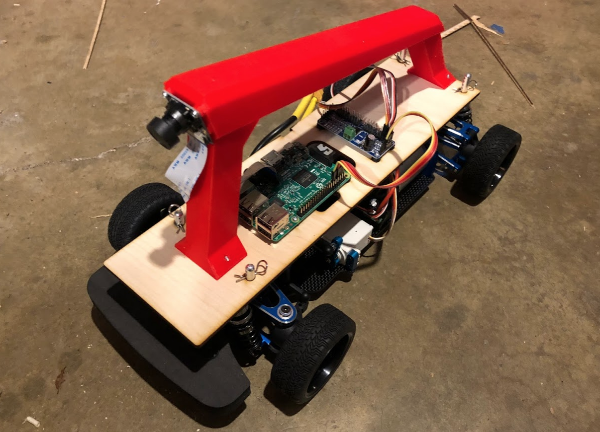

# サポート対象車両

## Magnet and HSP 94186
Magnet Classic は、最初の標準Donkey Carです。しかし、いまは多くの場合入手できないかもしれません。

ebay、banggood、ali expressなどでMagnetとHSP 94186の両方を検索してみてください。

HSP 94186はMagnetと同じで動作します。あなたが標準中国語を話せるなら、いつでも淘宝網で購入可能です。

https://item.taobao.com/item.htm?spm=a230r.1.14.1.478a6da8CUjrQQ&id=6004880592&ns=1&abbucket=12#detail

## Exceed Desert Monster, Short Course Truck, and Blaze
Desert Monster、SCT、BlazeはMagnetと同じメーカが製造し、同じモータとESCを使用しています。シャーシはわずかに異なりますので、標準Donkeyプラットフォームで動作させるには、アダプタといくつかの余分なハードウェアが必要です。アダプタを使用すると、カメラの配置はマグネットと同じになり、モデルを共有できるはずです。

Desert Monster と SCT には、細く道路にやさしいタイヤが含まれていて、ブレイズにはやや窮屈な構造であり、物にぶつかりにくいという特徴があります。

購入するには、次のリンクをクリックしてください：

*  Exceed Desert Monster [青](http://amzn.to/2HLXJmc),  [赤](http://amzn.to/2pnIitV)
*  Exceed Short Course Truck  [青](https://amzn.to/2KsYF1e),  [赤](https://amzn.to/2rdtQ8z)
*  Exceed Blaze [ハイパーブルー](https://amzn.to/2rf4MgS), [イエロー](https://amzn.to/2jlf3EA)

これらのうちの1つを組み立てるには、標準ビルドよりもいくつかの追加部品が必要です。これらは Donkey Store で購入できます： [Donkey Storeにて購入](https://squareup.com/store/donkeycar)

| 部品の説明 | リンク  | 参考価格 |
|---|----|---|
|3D プリント済み アダプタ | ファイル: [thingiverse.com/thing:2260575](http://www.thingiverse.com/thing:2260575)| 米10ドル |
| クラシッククリップ | [アマゾン](http://amzn.to/2FNSCFI) | 米5ドル|

プラスチックカバーとロールケージを最初に取り除くには、カバーを保持しているポストを外し、アダプタと交換します。

ビジュアルについては後述します。

## Tamaya TT-01 (上級者向け)

TT-01はDonkeyのハイエンドバージョンである新しいビルドです。これは高度なビルドであり、既存のRCスキル、またはそれらを学びたいという欲求と、試行錯誤の意欲を必要とします。初心者の方はMagnetをお勧めします。それは、それは人々が知っておくべきいくつかの長所・短所があります：

長所：

* 滑らかな路面での運動とトラクションの向上 - 基本的にはコーナリングがよくなります。
* 他のセンサを追加するためのより広いビルドエリアを確保できます。
* 世界中にいくつかのクローンRCカーが存在しています。

短所：

* 組み立てが必要です！ - あなた自身のESC、バッテリ、サーボ、ピニオンギア、モータを供給する必要があります。
* ドライブウェイや駐車場のような滑らかな表面で走る必要があります。
* シャーシを3Dプリントするには、より大きなサイズの3Dプリンタが必要です。用意できない場合は Donkey Storeで購入できます。
* 高価です。

標準Donkeyパーツや、Raspberry Pi などに加えて、次のコンポーネントを購入する必要があります。

| パーツの説明 | リンク  | 参考価格 |
|------|-------------|------------------|
|TT-01 Clone Chassis| [eBay](https://www.ebay.com/itm/Alloy-Carbon-TT01-TT01E-Shaft-Drive-1-10-4WD-Racing-Car-Chassis-Frame-Kit/261607459461?_trkparms=aid%3D555019%26algo%3DPL.BANDIT%26ao%3D1%26asc%3D20150817211623%26meid%3Da9b0995835f04dc2ae610bb9de46099b%26pid%3D100505%26rk%3D1%26rkt%3D1%26%26itm%3D261607459461&_trksid=p2045573.c100505.m3226) ほかは TT01s シャーシをおそらく使用しています。 | 米130ドル |
|ESC|https://hobbyking.com/en_us/hobbyking-x-car-45a-brushed-car-esc.html |米10.60ドル|
|ブラシ付きモータ |https://hobbyking.com/en_us/mabuchi-rs-540sh-6527-brushed-motor-90w.html |米5ドル|
|ステアリングサーボ|https://hobbyking.com/en_us/hobbykingtm-hk15138-standard-analog-servo-4-3kg-0-17sec-38g.html| $5|
|バッテリ|https://hobbyking.com/en_us/turnigy-5000mah-2s1p-20c-hardcase-pack-roar-approved-de-warehouse.html もしくは 2S 50000 mAh バッテリの類似品| 米21ドル |
|ピニオンギア| https://www.amazon.com/gp/product/B001BHGIBG/ref=oh_aui_detailpage_o08_s00?ie=UTF8&psc=1|$7|
|TT01 Plastics | Thingiverse: https://www.thingiverse.com/thing:2805287 もしくは Donkeyストア: https://squareup.com/store/donkeycar | 米50ドル|

Note: purchasing from Hobbyking is tricky.  They can ship from multiple warehouses and it can be expensive and time consuming if shipping from one overseas.  You may need to buy an alternate component if one of the items above are not available in your local warehouse.

> 注意：Hobbyking からの購入は注意が必要です。 Hobbyking は複数の倉庫から出荷しており、海外から出荷する場合は高価だったり時間がかかることがあります。 近くの倉庫で利用できない場合は、代替コンポーネントを購入する必要があります。

## 独自車両を使いたい場合
標準のDonkey Car とは全く異なる構造になる可能性があります。ですが、いまだいろんな方が挑戦しており、そういった方々と一緒に活動をするのは楽しいです。実際私たちは世界各地の様々な Donkey 競技で、さまざまな車を見ました。

しかし、知っておくべきいくつかのことがあります。そうでないと成功しません。低コストのオプションが機能しない場合は、多くのコストと品質のトレードオフがあります。私たちは既に利用可能な最も安価なオプションを見つけようと熱心に取り組んだので、お金を節約するために他のオプションを選択することは期待してはいけません。独自車両開発とは、学習、実験し、新しい場所や無料の場所を見つけることも含まれるのです。

詳細については、 [Roll Your Own](/roll_your_own.md) を参照してください。
